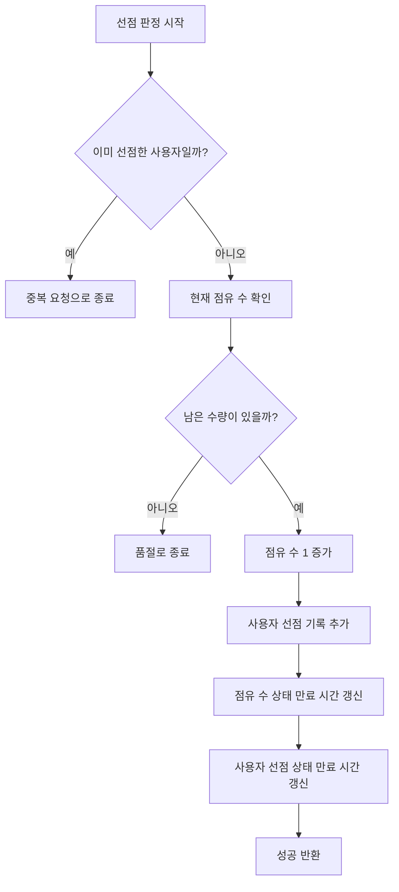
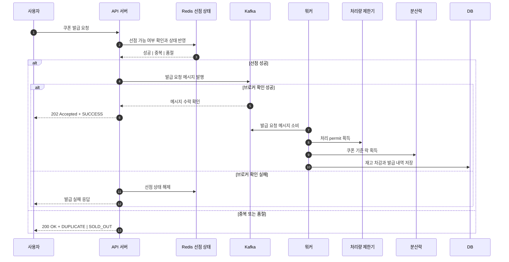
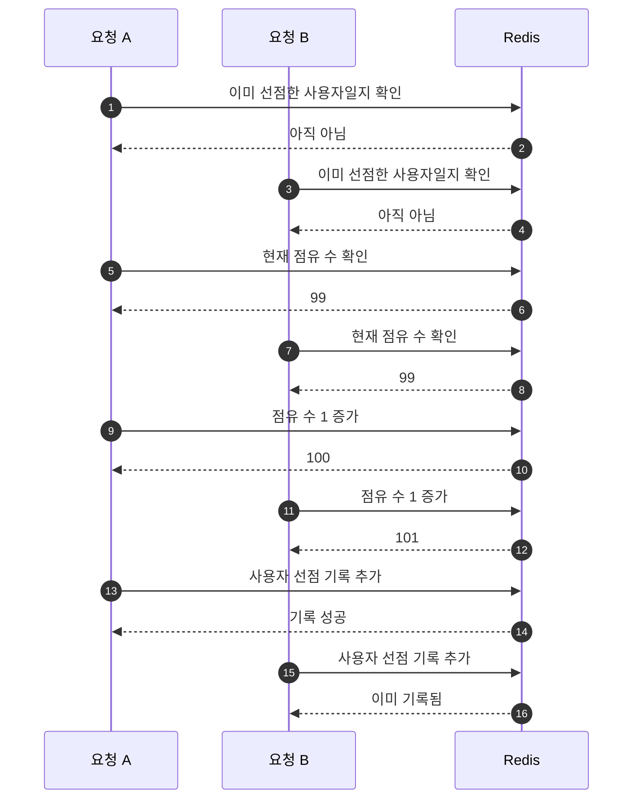

## 서론

이번 `coupon-system-design` 프로젝트에서 저는 Redis Lua 스크립트를 처음 사용했습니다.

처음에는 `GET`, `INCR`, `SADD`, `EXPIRE` 같은 Redis 명령 조합의 함수들만 잘 조합하면 충분하다고 생각했습니다. 실제로 로컬에서 단일 요청만 보면 그렇게 구현해도 그럴듯해 보였습니다. 그런데 공개 쿠폰 발급 경로를 실제로 묶어보니, 이 문제는 단순한 캐시 CRUD가 아니라 **짧은 시간 안에 두 개 이상의 Redis 상태를 함께 판정하고 갱신해야 하는 문제**였습니다. (Atomic)

"Redis가 기본으로 제공하는 명령만 조합해서도 구현은 할 수 있는데, 왜 굳이 Lua 스크립트까지 갔는가?" 구현을 진행하면서 제가 계속 붙잡고 있던 질문은 바로 이것이었습니다. 이 글은 그 질문에 답하기 위해 정리한 기록입니다.

Lua 스크립트가 무엇인지부터 시작해서, 왜 이번 프로젝트에서 Redis 기본 명령 조합 대신 Lua를 선택했는지, `WATCH/MULTI`, 파이프라이닝, 분산락과는 무엇이 달랐는지, 그리고 실제 코드에서 reserve/release/rebuild를 어떻게 사용했는지까지 차례대로 정리해보겠습니다.


## 왜 이 글을 쓰게 되었는가

이 글을 쓰게 된 이유는 간단합니다. 이번 프로젝트에서 Lua를 처음 썼는데, 막상 구현을 해보니 "왜 Redis에서 굳이 Lua까지 써야 하지?"라는 질문이 생각보다 자주 생겼기 때문입니다. 쿠폰 발급으로 Redisson 분산 락을 초기 구현으로 진행하다가 Kafka로 전환하며 worker 서버에서 core 서버와의 MQ 지연 시간에 대한 간극이 발생됩니다. 정말 미세하지만 (MQ 발행에 대한 시간 + worker 서버에서 KafkaListener를 통한 수신 시간)까지 동시 다발적으로 발급을 시도하면 짧은 시간에 대해서 Race Condition을 극복해야 하기에 원자성 강화를 목표로 Lua 스크립트를 활용하게 되었습니다.

특히 쿠폰 발급 경로에서는 아래 조건이 동시에 붙습니다.

- 이미 선점한 사용자인지 확인해야 합니다
- 남은 수량을 넘지 않게 막아야 합니다
- 통과하면 점유 수와 사용자 마커를 함께 기록해야 합니다
- TTL도 같이 맞춰야 합니다
- 실패하면 보상 경로에서 다시 되돌릴 수 있어야 합니다

이 조건을 한 번에 놓고 보니, 제가 풀고 있던 문제는 "Redis 명령을 몇 개 쓰느냐"가 아니라 **입구에서 짧고 원자적인 상태 전이를 어떻게 만들 것이냐**였습니다.

## Lua 스크립트는 무엇인가

Redis에서 Lua 스크립트는 Redis 서버 안에서 실행되는 짧은 사용자 정의 로직입니다. <a href="#ref-e1">[E1]</a> <a href="#ref-e2">[E2]</a>

애플리케이션에서 `SISMEMBER`, `GET`, `INCR`, `SADD`, `EXPIRE`를 순서대로 여러 번 보내는 대신, 그 순서를 하나의 스크립트로 Redis에 전달하면 Redis가 자기 안에서 그 로직을 실행합니다. 이 방식의 핵심은 두 가지입니다.

1. 데이터가 있는 위치에서 읽기와 쓰기를 바로 이어서 수행할 수 있습니다
2. 스크립트가 실행되는 동안 다른 명령이 중간에 끼어들지 않습니다

그래서 Lua는 "Redis에 복잡한 비즈니스를 다 넣는 도구"라기보다, **짧고 원자적인 상태 전이를 서버 쪽으로 밀어 넣는 도구**에 가깝습니다.

저는 이걸 구현하면서 `입구에서 번호표와 좌석 수를 동시에 확인하는 안내 데스크`처럼 이해했습니다. 누가 이미 번호표를 받았는지 확인하고, 아직 좌석이 남아 있는지 확인하고, 통과했다면 번호표와 좌석 점유를 같이 기록해야 하는 상황입니다. 다만 이 비유가 전부는 아닙니다. 실제로 중요한 것은 비유보다도, **두 상태를 함께 판정하고 함께 반영해야 한다는 구조**입니다.

또 한 가지는 꼭 짚고 넘어가야 합니다. Redis가 말하는 Lua의 원자성은 **명령 간 interleaving을 막는다**는 의미에 가깝습니다.<a href="#ref-e1">[E1]</a>, <a href="#ref-e3">[E3]</a> 관계형 DB 트랜잭션처럼 우리가 익숙한 rollback 모델을 그대로 제공한다고 받아들이면 오해가 생깁니다.

## 구조 고정

먼저 고정해야 하는 사실이 있습니다.

- 발급에 대한 생명주기는 `Redis reserve -> Kafka publish -> worker consume -> distributed lock -> DB persist` 입니다.
- `POST /coupon-issues`의 `SUCCESS`는 최종 DB 발급 완료가 아닙니다
- 현재 `SUCCESS`는 **Redis reserve 성공 + Kafka broker ack 성공**을 의미합니다
- 최종 DB 반영은 worker가 비동기로 처리합니다
- outbox는 intake durability가 아니라 lifecycle projection durability를 담당합니다
- Redis 책임은 나눠져 있습니다
  - `reserve / release / rebuild`: Lua
  - distributed lock / processing limit: Redisson
  - 일반 cache: `Cache` + `RedisTemplate`
  
### `reserve`, `release`, `rebuild`는 각각 어떤 함수일까

이 세 함수는 이름은 단순해 보이지만, 실제로는 서로 다른 순간에 호출되는 Redis 상태 관리 함수입니다.

| 함수 | 언제 호출하는가 | 하는 일 |
| --- | --- | --- |
| `reserve` | API 수신 단에서 선점할 때 | 중복 여부와 남은 수량을 함께 확인하고, 통과하면 점유 수와 사용자 선점 기록을 함께 반영합니다 |
| `release` | publish 실패, terminal reject, DLQ 확정처럼 선점을 되돌려야 할 때 | 사용자 선점 기록을 먼저 지우고, 실제로 기록이 지워진 경우에만 점유 수를 1 줄입니다 |
| `rebuild` | Redis 상태가 비었거나 초기화가 필요할 때 | DB 기준 스냅샷으로 점유 수와 사용자 선점 집합을 다시 구성합니다 |

제가 구현하면서 이 세 함수를 한 세트로 보게 된 이유도 여기에 있습니다. `reserve`만 잘 만든다고 끝나지 않았고, 실패했을 때 어떻게 되돌릴지, Redis가 비었을 때 어떻게 다시 맞출지까지 같이 정의해야 했기 때문입니다.

조금 더 풀어서 보면 의미가 더 분명해집니다.

#### `reserve`

`reserve`는 가장 앞단에서 호출되는 함수입니다.  
같은 사용자가 이미 선점했는지 먼저 확인하고, 현재 점유 수가 총 수량을 넘지 않는지도 같이 봅니다. 이 두 조건을 통과한 경우에만 점유 수와 사용자 선점 기록을 함께 반영하고, 그 결과에 따라 `SUCCESS`, `DUPLICATE`, `SOLD_OUT`으로 return 해줍니다.

즉, 이 함수는 "발급을 확정한다"기보다 **입구에서 선점할 수 있는 상태인지 짧게 판정하고 반영하는 함수**에 가깝습니다.

#### `release`

`release`는 선점 상태를 되돌리는 함수입니다.  
여기서 중요한 점은 무조건 점유 수를 줄이지 않는다는 점입니다. 먼저 사용자 선점 기록을 제거해보고, 실제로 제거가 일어난 경우에만 점유 수를 1 줄입니다.

이렇게 해두면 중복 release가 들어오더라도 점유 수가 계속 내려가면서 상태가 깨지는 일을 줄일 수 있습니다. 저는 이 부분이 `release`를 별도 Lua 함수로 둔 이유 중 하나라고 느꼈습니다. 단순히 `DECR` 한 번으로 끝낼 수 있는 문제가 아니었기 때문입니다.

#### `rebuild`

`rebuild`는 Redis 상태를 다시 만드는 함수입니다.  
현재 저장소는 Redis state가 비어 있으면 DB 기준으로 상태를 복구합니다. 이때 `rebuild`는 기존 `occupied-count`와 `reserved-users`를 지우고, DB에서 계산한 점유 수와 발급 사용자 목록으로 다시 구성합니다.

이 부분은 서비스 코드에서도 그대로 드러납니다. Redis 상태가 없으면 먼저 DB에서 발급 사용자 목록과 점유 수를 읽고, 그 값을 `rebuild()`로 다시 밀어 넣습니다.

```kotlin
@Service
class CouponIssueStateInitializationExecutor(
    private val couponIssueRepository: CouponIssueRepository,
    private val couponIssueRedisRepository: CouponIssueRedisRepository,
) {
    @WithDistributedLock(
        key = "'COUPON_ISSUE_STATE_INIT:' + #coupon.id",
        timeoutMillis = 1_000L,
    )
    fun initializeStateIfAbsent(
        coupon: CouponDetail,
        ttl: Duration,
    ) {
        if (couponIssueRedisRepository.hasState(coupon.id)) {
            return
        }

        val issuedUsers = couponIssueRepository.findUserIdsByCouponId(coupon.id)
        val occupiedCount = coupon.totalQuantity - coupon.remainingQuantity
        couponIssueRedisRepository.rebuild(
            couponId = coupon.id,
            occupiedCount = occupiedCount,
            userIds = issuedUsers,
            ttl = ttl,
        )
    }
}


if (!couponIssueRedisRepository.hasState(coupon.id)) {
    couponIssueStateInitializationExecutor.initializeStateIfAbsent(coupon, ttl)
}

val issuedUsers = couponIssueRepository.findUserIdsByCouponId(coupon.id)
val occupiedCount = coupon.totalQuantity - coupon.remainingQuantity
couponIssueRedisRepository.rebuild(coupon.id, occupiedCount, issuedUsers, ttl)
```

즉, `rebuild`는 단순 초기화 함수가 아니라 **Redis를 다시 현재 truth에 맞추는 복구 함수**입니다.

결국 이 세 함수는 역할이 다르지만 하나의 흐름으로 이어집니다.

- 요청을 받으면 `reserve`로 선점합니다
- 실패하거나 더 이상 처리하지 않을 때는 `release`로 되돌립니다
- Redis 상태가 없거나 복구가 필요할 때는 `rebuild`로 다시 맞춥니다

그래서 이번 프로젝트에서 Lua를 쓴 이유를 설명할 때도 `reserve 하나를 원자적으로 처리했다`에서 멈추기보다, **reserve/release/rebuild로 나누어 전체를 같은 상태 전이 모델로 유지했다**고 보는 편이 더 정확했습니다.

아래 flowchart도 마찬가지로, 실제 명령 이름은 코드 블록에서 설명하고 그림에서는 상태 의미가 먼저 보이도록 정리했습니다.



> 코드 컨텍스트
> - `CouponIssueIntakeFacade.issue()`는 reserve 성공 뒤 Kafka publish를 시도하고, publish 실패 시 `release()`로 보상합니다.
> - `CouponIssueService.reserveIssue()`는 Redis 상태가 비어 있으면 `initializeStateIfAbsent()`를 거쳐 `rebuild()`를 호출합니다.
> - `CouponIssueRedisCoreRepository`는 `reserve`, `release`, `rebuild`를 한 저장소에 모아 둡니다.

이 계약을 먼저 고정하지 않으면 Lua의 역할도 쉽게 헷갈립니다. Lua는 "최종 발급을 끝내는 계층"이 아니라, **입구에서 reserve 상태를 짧고 정확하게 판정하는 계층**입니다.



## 왜 Redis 기본 명령 조합만으로는 부족했을까

제가 처음 떠올린 구현은 대략 이런 형태였습니다.

```kotlin
fun reserveWithoutLua(
    couponId: Long,
    userId: Long,
    totalQuantity: Long,
    ttl: Duration,
): CouponIssueResult {
    val occupiedKey = "coupon:issue:state:$couponId:occupied-count"
    val usersKey = "coupon:issue:state:$couponId:users"

    val duplicate = redisTemplate.opsForSet().isMember(usersKey, userId.toString()) == true
    if (duplicate) return CouponIssueResult.DUPLICATE

    val occupiedCount = redisTemplate.opsForValue().get(occupiedKey)?.toLong() ?: 0L
    if (occupiedCount >= totalQuantity) return CouponIssueResult.SOLD_OUT

    redisTemplate.opsForValue().increment(occupiedKey)
    redisTemplate.opsForSet().add(usersKey, userId.toString())
    redisTemplate.expire(occupiedKey, ttl)
    redisTemplate.expire(usersKey, ttl)
    return CouponIssueResult.SUCCESS
}
```

이 코드는 로컬에서 혼자 실행하면 얼핏 괜찮아 보입니다. 그러나 동시 요청이 들어오면 바로 문제가 보입니다.

### 문제 1. check와 set 사이에 race window가 생깁니다

예를 들어 같은 사용자가 거의 동시에 두 번 요청한다고 가정해보겠습니다. 아래 그림은 Redis 명령 이름을 그대로 옮기기보다, 독자가 이해하기 쉬운 의미 중심으로 풀어 쓴 흐름입니다.




이 경우 두 번째 `SADD`는 실패하더라도 `INCR`은 이미 한 번 더 올라간 뒤입니다. 즉, **중복 사용자는 막았지만 점유 수는 틀어진 상태**가 됩니다.

이 문제는 `SADD` 하나로 중복을 막을 수 있느냐의 문제가 아닙니다. 점유 수와 선점 기록 수가 서로 다른 key이기 때문에, 둘 중 하나만 반영된 상태가 중간에 충분히 만들어질 수 있다는 점이 핵심입니다.

### 문제 2. sold-out 판정도 흔들릴 수 있습니다

`GET occupiedCount`와 `INCR`가 분리되어 있으면, 두 요청이 같은 값을 읽고 둘 다 통과할 수 있습니다. 그러면 `totalQuantity`를 넘는 점유가 생길 수 있습니다.

물론 최종 DB 구간에는 마지막 방어선이 있습니다. 하지만 이 저장소에서 reserve는 입구에서 duplicate와 sold-out을 빠르게 잘라내는 역할을 맡습니다. 입구 판정이 흔들리기 시작하면 이후 Kafka publish, 보상 release, retry/DLQ 경로까지 전부 복잡해집니다.

### 문제 3. TTL도 함께 맞춰야 합니다

이번 구현에서는 점유 수와 선점 기록 수에 같은 TTL을 걸어야 했습니다.

그런데 일반 명령 조합에서는 아래 상황을 매번 생각하게 됩니다.

- `INCR`는 성공했는데 `SADD`는 실패하면 어떻게 할지
- 두 key는 갱신됐지만 한쪽 `EXPIRE`만 빠지면 어떻게 복구할지
- publish 실패 보상과 TTL 갱신 타이밍이 겹치면 어떤 상태를 truth로 볼지

즉, 겉으로는 단순한 RedisTemplate 코드처럼 보여도, 실제로는 애플리케이션 바깥에 **보상 로직과 재시도 로직이 계속 불어나는 구조**가 됩니다.

여기서 제가 중요하게 봤던 포인트는 이것입니다. "구현 가능 여부"만 보면 Redis 기본 명령 조합으로도 충분해 보입니다. 하지만 실제로는 duplicate, sold-out, TTL, 보상 release, 상태 복구까지 한 번에 생각해야 했고, 그 순간부터 이 문제는 단순한 명령 조합이 아니라 **상태 전이 경계 설계** 문제가 되었습니다.

## `WATCH/MULTI`, 파이프라이닝, 락은 왜 이번 선택이 아니었을까

여기서부터는 "다른 선택들이 틀렸다"가 아니라, "이번 이슈에 대해서 지금 무엇이 더 맞았는가"의 이야기입니다.

### `WATCH/MULTI`로도 가능하지 않았을까

가능합니다. Redis 공식 문서도 `WATCH`를 이용한 optimistic locking 방식을 설명합니다. <a href="#ref-e3">[E3]</a>

개념적으로는 아래처럼 구성할 수 있습니다.

```text
WATCH occupiedKey usersKey
SISMEMBER usersKey userId
GET occupiedKey
MULTI
INCR occupiedKey
SADD usersKey userId
EXPIRE occupiedKey ttl
EXPIRE usersKey ttl
EXEC
```

문제는 이 다음입니다.

- `WATCH`한 key가 `EXEC` 전에 변경되면 트랜잭션 전체가 abort 됩니다
- abort 되면 애플리케이션이 흐름 전체를 다시 재시도해야 합니다
- duplicate, sold-out, retry-needed를 클라이언트 코드가 다시 판정해야 합니다
- 결국 핵심 상태 전이 로직이 Redis 밖의 애플리케이션 코드로 더 많이 새어 나옵니다

즉, `WATCH/MULTI`는 분명한 대안이지만, 이번 reserve처럼 **짧고 명확한 한 덩어리 상태 전이**를 만들고 싶을 때는 오히려 구현 경계가 더 커졌습니다.

### 파이프라이닝은 왜 다른 문제일까

파이프라이닝은 RTT를 줄이는 최적화입니다. <a href="#ref-e4">[E4]</a>

이 점은 분명히 유용합니다. 다만 파이프라이닝은 여러 명령을 더 빨리 보내는 기술이지, 여러 명령을 **하나의 원자 상태 전이**로 바꾸는 기술은 아닙니다. 따라서 아래 문제는 그대로 남습니다.

- `SISMEMBER -> GET -> INCR -> SADD -> EXPIRE` 사이의 경쟁 조건
- 일부 명령만 반영된 상태를 어떻게 해석하고 복구할지의 복잡성

이번 문제에서 제가 줄이고 싶었던 것은 왕복 시간만이 아니라, **판정과 갱신이 분리되면서 생기는 구조적 불안정성**이었습니다.

### 그럼 락으로 감싸면 되지 않았을까

이 질문도 당연히 나올 수도 있습니다. 실제로 이 저장소는 worker 최종 반영 구간에서 Redisson 기반 분산락을 사용합니다.

하지만 reserve는 성격이 다릅니다.

- reserve는 아주 짧은 다중 key 상태 전이입니다.
- worker의 최종 DB 반영은 메서드 실행 구간 전체를 보호해야 하는 문제입니다.

또한 락 점유를 하는 시간 TTL이 길다면, 그것 또한 문제가 될 수 있었습니다.

즉, 둘 다 동시성을 다루기는 하지만 해결하려는 문제가 다릅니다. 이번 저장소는 그 차이를 아래처럼 나눴습니다.

| 선택지 | 무엇을 해결하는가 | 이번 저장소에서의 판단 |
| --- | --- | --- |
| 일반 Redis 명령 조합 | 단순 CRUD, 개별 명령 실행 | 다중 key 판정+갱신에는 경계가 약했습니다 |
| `WATCH/MULTI` | optimistic CAS | 구현 복잡도와 재시도 부담이 더 컸습니다 |
| 파이프라이닝 | RTT 감소 | 원자 상태 전이 문제를 직접 풀지는 못했습니다 |
| Redisson Lock | 실행 구간 전체 보호 | reserve에는 과했고, worker final persist에는 적절했습니다 |
| Lua | 짧은 다중 key 상태 전이 | 이번 reserve 문제에 가장 직접적으로 맞았습니다 |

### Redis Functions까지는 왜 가지 않았을까

Redis 7에는 `EVAL` 기반 스크립트보다 한 단계 더 나아간 Redis Functions가 있습니다. <a href="#ref-e5">[E5]</a>

다만 이번 저장소에서는 아직 그 단계까지는 가지 않았습니다. 이유는 단순합니다.

- 지금 필요한 서버 쪽 로직이 `reserve / release / rebuild` 정도로 비교적 작았습니다
- 이 로직은 여러 서비스가 공유하는 공통 Redis 함수 라이브러리라기보다, 현재 애플리케이션이 소유하는 도메인 로직에 더 가까웠습니다
- 현재는 `DefaultRedisScript` 기반으로도 충분히 책임 경계를 분리할 수 있었습니다

즉, 이번 선택은 "Functions를 몰라서 안 썼다"가 아니라, **지금 필요한 운영 복잡도와 책임 범위에 비해 과하다고 판단해서 보류했다**에 가깝습니다.

## 현재 프로젝트에서는 Lua를 어떻게 사용했는가

현재 저장소에서 Lua는 reserve 한 곳에만 잠깐 들어가는 장식이 아닙니다. 핵심 판정인 `reserve`, 보상용 `release`, 상태 복구용 `rebuild`를 같은 책임 경계 안에서 담당합니다.

> 코드 컨텍스트
> - `CouponIssueRedisCoreRepository.reserve()`는 Lua 반환값 `0 / 1 / 2`를 `SUCCESS / DUPLICATE / SOLD_OUT`으로 매핑합니다.
> - 같은 저장소 안에 `release()`와 `rebuild()`도 같이 들어 있어서, 선점, 보상, 복구가 한 경계로 묶입니다.
> - 즉, 이 저장소에서 Lua는 단일 함수 최적화가 아니라 Redis 상태 관리 모델 자체를 이루는 코드입니다.

그중에서 가장 중요한 `reserve` 스크립트는 아래와 같습니다.

```lua
local occupiedKey = KEYS[1]
local usersKey = KEYS[2]
local userId = ARGV[1]
local totalQuantity = tonumber(ARGV[2])
local ttlSeconds = tonumber(ARGV[3])

if redis.call('SISMEMBER', usersKey, userId) == 1 then
  return 1
end

local occupiedCount = tonumber(redis.call('GET', occupiedKey) or '0')
if occupiedCount >= totalQuantity then
  return 2
end

occupiedCount = redis.call('INCR', occupiedKey)
redis.call('SADD', usersKey, userId)
redis.call('EXPIRE', occupiedKey, ttlSeconds)
redis.call('EXPIRE', usersKey, ttlSeconds)
return 0
```

이 스크립트가 하는 일은 딱 세 단계로 요약됩니다.

1. duplicate인지 먼저 확인합니다
2. sold-out인지 확인합니다
3. 통과하면 점유 수, 사용자 마커, TTL을 함께 반영합니다

그리고 Kotlin 쪽에서는 이 숫자 코드를 바로 도메인 결과로 매핑합니다.

```kotlin
val result =
    redisTemplate.execute(
        reserveScript, // 위 스크립트
        listOf(occupiedCountKey(couponId), reservedUsersKey(couponId)),
        userId.toString(),
        totalQuantity.toString(),
        ttl.seconds.coerceAtLeast(1).toString(),
    ) ?: error("Coupon issue state script returned null")

return when (result) {
    0L -> CouponIssueResult.SUCCESS
    1L -> CouponIssueResult.DUPLICATE
    2L -> CouponIssueResult.SOLD_OUT
    else -> error("Unexpected coupon issue state result: $result")
}
```

이 구조에서 좋다고 생각한 것이 reserve의 의미가 `reserve()` 하나에 선명하게 모인다는 점입니다. "duplicate check, sold-out check, count 증가, user marker 반영, TTL 갱신"이라는 비즈니스 의미가 여러 서비스 레이어에 흩어지지 않고, Redis 경계 하나로 모입니다.

그리고 이번 저장소는 reserve만 Lua로 끝내지 않습니다. 보상용 `release`, Redis state 복구용 `rebuild`도 같은 패밀리로 구현합니다. 이 점이 뒤에서 설명할 실패 처리와 연결됩니다.

즉, 현재 프로젝트에서 Lua를 사용하는 방식은 아래처럼 이해하면 읽기 쉽습니다.

- reserve: 입구에서 중복과 수량을 함께 판정합니다
- release: publish 실패나 terminal failure에서 선점 상태를 되돌립니다
- rebuild: Redis state가 비었을 때 DB 기준으로 다시 맞춥니다

이 세 가지가 같은 저장소 안에서 같이 움직이기 때문에, Lua 선택 이유도 reserve 한 함수만 떼어서 보기보다 **현재 프로젝트의 Redis 상태 관리 방식 전체**로 보는 편이 더 정확합니다.


## 실패 처리와 상태 복구에서는 무엇이 달라졌는가

처음 구현하면서 제가 예상보다 크게 느꼈던 지점은 "성공 경로"보다 "실패 경로"였습니다.

Lua를 선택한 이유를 성능이나 원자성 한 줄로만 설명하면 이 부분이 잘 보이지 않습니다. 실제로는 아래 실패 처리와 상태 복구가 같이 맞물려 있습니다.

### 1. publish 실패 시 reserve를 즉시 되돌린다

이 저장소에서 `SUCCESS`는 Redis reserve + Kafka broker ack입니다.  
즉, reserve는 성공했지만 publish가 실패할 수 있습니다. 이 경우 intake 쪽에서 바로 `release(couponId, userId)`를 호출해 Redis 선점 상태를 되돌립니다.

이 흐름은 코드에서도 꽤 직접적으로 보입니다.

```kotlin
val reserveResult = couponIssueService.reserveIssue(coupon, command.userId)
if (reserveResult != CouponIssueResult.SUCCESS) {
    return reserveResult
}

return try {
    couponIssueMessagePublisher.publish(message)
    CouponIssueResult.SUCCESS
} catch (exception: Exception) {
    couponIssueService.release(command.couponId, command.userId)
    throw ErrorException(ErrorType.COUPON_ISSUE_KAFKA_ERROR)
}
```

이 보상 경로가 깔끔해야 reserve를 입구에서 안심하고 선점할 수 있습니다.

### 2. worker terminal reject나 DLQ 확정 때도 release가 이어진다

worker는 최종 persist를 담당하고, retry/DLQ까지 포함해 실패를 처리합니다.  
이 과정에서 retryable failure와 terminal failure를 구분하고, 최종적으로 더 이상 처리하지 않을 실패에서는 Redis reserve를 release해야 합니다.

즉, reserve는 단독 함수가 아니라 **보상 경로와 한 세트**로 이해해야 합니다.

### 3. Redis state가 비어 있으면 rebuild도 필요하다

이 저장소는 Redis state가 비어 있으면 DB 기준으로 상태를 다시 복구합니다.

이 점도 중요했습니다. Lua를 택한 이유는 단지 reserve 한 번을 빨리 끝내기 위해서가 아니라, reserve/release/rebuild를 같은 책임 경계 안에서 유지하기 위해서이기도 합니다. 그래야 cold start나 Redis flush 이후에도 같은 의미 체계를 이어갈 수 있습니다.

정리하면 이번 Lua 선택은 단순히 "빠른 명령 하나"의 문제가 아니었습니다. **성공, 보상, 복구를 같은 의미 체계로 묶는 문제**였습니다.

## 여기서 헷갈리기 쉬운 지점

이 주제는 특히 아래 세 지점이 자주 헷갈립니다.

### 1. `SUCCESS`는 최종 발급 완료가 아니다

이 저장소에서 `SUCCESS`는 Redis reserve와 Kafka broker ack 성공입니다.  
최종 DB 반영은 worker가 비동기로 처리합니다.

### 2. outbox는 intake durability 계층이 아니다

outbox는 `COUPON_ISSUED / COUPON_USED / COUPON_CANCELED` 이후의 projection durability를 담당합니다.  
즉, 이 글에서 다루는 Lua reserve와 outbox는 역할이 다릅니다.

### 3. Lua와 락은 같은 역할이 아니다

Lua는 짧은 상태 전이에 가깝고, Redisson lock은 메서드 실행 구간 전체를 보호하는 데 가깝습니다.  
둘 다 Redis를 쓰지만, 같은 문제를 다른 방식으로 푸는 것이 아닙니다. 애초에 다루는 시간이 다르고, 보호하려는 경계가 다릅니다.

## 최종 결정

이번 저장소에서의 최종 결정은 아래처럼 정리할 수 있습니다.

- reserve/release/rebuild 같은 짧은 상태 전이 메서드를 구분하고, Lua로 처리한다.
- worker 최종 반영처럼 실행 구간 전체를 보호해야 하는 곳은 Redisson lock으로 처리한다.
- cluster-wide 처리량 제한은 `RRateLimiter`로 처리한다.

즉, Redis를 한 가지 도구로만 밀어붙이지 않았습니다. **문제의 성격에 따라 Redis 안에서도 도구를 나눴습니다.**

제가 이번에 얻은 결론은 이것입니다. "Redis에서 Lua를 쓴다"가 중요한 것이 아니라, **Redis 기본 명령 조합으로는 경계가 흐려지는 순간, Lua가 가장 단순한 상태 전이 모델이 될 수 있다**는 점이 중요합니다.

## 결론

이번 작업을 하면서 얻은 교훈은 세 가지였습니다.

1. Redis 명령이 충분히 많으며 명령어들을 조합하여도 그 조합이 곧 좋은 모델이 되지는 않습니다.
   문제는 명령 수가 아니라 원자성 경계였습니다.

2. 동시성 문제는 성공 경로보다 실패 경로에서 더 선명하게 드러납니다.
   publish 실패, terminal reject, DLQ, rebuild를 같이 보면 왜 Lua가 편했는지가 더 명확해집니다.

3. Redis도 역할을 분리해서 써야 합니다  
   Lua, Redisson lock, limiter, cache는 같은 Redis를 쓰더라도 같은 책임을 맡지 않습니다.

이번 `coupon-system-design`에서 Lua는 "멋져 보여서" 들어간 기술이 절대 아니었습니다.
이번 쿠폰 시스템을 개발하면서 원자성에 대해서 공부를 할 수 있었고, 단순히 우리가 막연하게 동시성 이슈를 해결하기 위해 낙관적/비관적 락에서 Redisson 분산 락까지 도입도 해보고, 실제로 이 원자성이 미세하게라도 틀어진다면 문제가 될 수 있다는 점을 말하고 싶었습니다.
입구(reserve)에서 duplicate와 sold-out을 빠르게 자르고, 점유 수와 사용자 상태를 함께 묶고, 실패 시에는 같은 의미 체계로 release와 rebuild까지 이어가기 위해 선택한 도구였습니다.

## References

### External References

- <span id="ref-e1">[E1]</span> [Redis Docs: Scripting with Lua](https://redis.io/docs/latest/develop/programmability/eval-intro/)
- <span id="ref-e2">[E2]</span> [Redis Docs: Redis programmability](https://redis.io/docs/latest/develop/programmability/)
- <span id="ref-e3">[E3]</span> [Redis Docs: Transactions](https://redis.io/docs/latest/develop/using-commands/transactions/)
- <span id="ref-e4">[E4]</span> [Redis Docs: Redis pipelining](https://redis.io/docs/latest/develop/using-commands/pipelining/)
- <span id="ref-e5">[E5]</span> [Redis Docs: Redis functions](https://redis.io/docs/latest/develop/programmability/functions-intro/)
