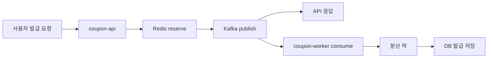
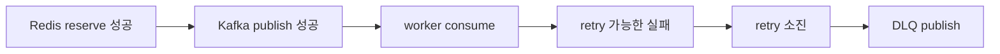
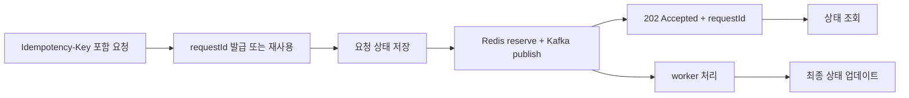

이전에는 [원자성을 고려한 Lua 스크립트](https://www.ybchar.dev/tech-blog/20260412_lua_script) 글에서 Redis 안에서 재고 차감과 상태 전이를 어떻게 묶었는지 정리했습니다.
이번에는 그 구조가 실제 부하에서 어떤 신호를 보이는지 `k6`로 확인해봤습니다.

처음에는 단순히 “몇 명까지 버티는가”를 알고 싶었습니다.
그런데 테스트를 돌려보니 더 중요한 질문은 조금 달랐습니다.

- 응답 성공을 최종 DB 반영으로 봐도 되는가?
- 정합성 문제와 응답 품질 문제를 어떻게 분리해서 볼 것인가?
- 실패가 났을 때 DLQ, retry, scale-out 중 무엇을 먼저 봐야 하는가?
- 현재 수치를 운영 판단으로 바꾸면 어떤 구성이 필요한가?

이번 글은 모든 k6 실행 결과를 나열하는 글이 아닙니다.
제가 실제로 의미 있다고 본 핵심 시나리오만 남기고, 그 숫자를 어떻게 해석했는지에 초점을 맞췄습니다.

## 먼저 성공 기준을 고정했습니다

이 시스템에서 `POST /coupon-issues`의 `SUCCESS`는 최종 DB 저장 완료가 아닙니다.

현재 발급 흐름은 아래와 같습니다.



즉, API 응답의 성공은 `Redis reserve + Kafka broker ack`까지 끝났다는 의미입니다.
worker가 Kafka 메시지를 consume하고 DB에 저장하는 과정은 뒤에서 비동기로 이어집니다.

그래서 k6 테스트에서도 API 응답만 보지 않았습니다.
특히 대량 동시 발급 시나리오에서는 아래 두 축을 분리해서 봤습니다.

| 확인 축 | 본 이유 |
| --- | --- |
| 응답 품질 | 사용자가 정상적인 응답을 받았는지 확인하기 위해서입니다. p95, 오류율, 정상 응답 확인율을 봤습니다 |
| 최종 정합성 | 비동기 worker 처리까지 끝난 뒤 과발급이 없는지 확인하기 위해서입니다. 최종 발급 건수와 잔여 재고를 poll 해서 확인했습니다 |

이 기준을 먼저 잡지 않으면 “응답이 성공했으니 발급도 끝났다”거나, 반대로 “테스트가 실패했으니 정합성이 깨졌다”처럼 잘못 읽기 쉽습니다.
이번 테스트에서 가장 중요했던 포인트도 바로 이 분리였습니다.

## 테스트 환경은 어떻게 봐야 하는가

이번 측정은 `2Core 8GB` 클라우드 환경에서 진행했고, `coupon-api`에는 `1Core`를 할당했습니다.

- `coupon-app`: `1 CPU`, `mem_limit 1536m`, `-Xmx768m`
- `coupon-worker`: `0.5 CPU`, `concurrency 1`, `permits 60/s`
- 같은 호스트에 `MySQL`, `Redis`, `Kafka`, `Grafana`, `Loki`, `InfluxDB`, `Kafka UI`가 함께 올라가 있었습니다


따라서 아래 수치는 순수한 애플리케이션 벤치마크가 아닙니다.
오히려 작은 운영 환경에 가까운 조건에서 “어떤 패턴이 먼저 흔들리는가”를 보기 위한 기준값에 가깝습니다.

## k6 시나리오는 어떻게 나눴는가

시나리오는 크게 세 가지로 나눴습니다.

| 시나리오 | 목적 | 핵심 질문 |
| --- | --- | --- |
| baseline | 평소 사용량 기준선 확인 | 일반적인 요청 패턴에서 회귀가 없는가 |
| sustained intake | 일정 시간 동안 계속 들어오는 발급 요청 확인 | 공개 API intake 경로의 지속 처리 경계는 어디인가 |
| issue burst | 특정 쿠폰 하나에 동시에 몰리는 경합 확인 | 과발급 없이 예측 가능한 응답을 줄 수 있는가 |

명령어를 전부 나열하지는 않겠습니다.
중요한 것은 `VU`, `duration`, `stock`, `poll timeout`을 바꿔가며 테스트 목적을 분리했다는 점입니다.

예를 들어 burst 테스트는 이런 형태였습니다.

```bash
node load-test/k6/run-with-slack.mjs issue-burst --profile prod -- \
  -e 'BASE_URL=https://coupon-api.yogieat.com' \
  -e 'ISSUE_BURST_VUS=900' \
  -e 'ISSUE_BURST_STOCK=1' \
  -e 'ISSUE_BURST_MAX_DURATION=5m' \
  -e 'ISSUE_POLL_TIMEOUT_SECONDS=60' \
  -e 'ISSUE_SETTLEMENT_TIMEOUT_SECONDS=180'
```

여기서 핵심은 요청을 보낸 뒤 바로 끝내지 않았다는 점입니다.
비동기 worker가 최종 상태를 반영할 시간을 주고, 최종 발급 건수와 잔여 재고까지 확인했습니다.
쿠폰 시스템처럼 `API 수락`과 `최종 처리`가 분리된 구조에서는 이 과정이 없으면 테스트가 반쪽짜리가 됩니다.

## baseline은 기준선으로만 사용했습니다

먼저 일반 사용량에 가까운 `15 VU / 10m` baseline을 돌렸습니다.

| 항목 | 결과 |
| --- | --- |
| 결과 | 성공 |
| p95 | `143.12ms` |
| 오류율 | `0.00%` |
| 정상 응답 확인율 | `100.00%` |

이 결과 자체가 특별한 결론을 주지는 않습니다.
다만 이후 overload, burst 결과를 비교할 기준선으로는 충분했습니다.

제가 여기서 확인하고 싶었던 것은 “일반적인 사용 패턴에서도 이미 흔들리는가”였습니다.
baseline이 깨진다면 burst를 논의하기 전에 기본 경로부터 다시 봐야 하기 때문입니다.

## sustained intake에서는 110~120 VU 사이에 경계가 보였습니다

다음은 일정 시간 동안 계속 들어오는 발급 요청입니다.
순간 경합보다, 2분 동안 지속적으로 요청이 들어올 때 API intake 경로가 어디까지 버티는지 봤습니다.


| VU | 결과 | p95 | 해석 |
| --- | --- | --- | --- |
| `90 VU / 2m` | 통과 | `462.83ms` | sustained intake 기준으로 안정적이었습니다 |
| `100 VU / 2m` | 통과 | `450.03ms` | 90 VU와 유사한 수준으로 유지됐습니다 |
| `110 VU / 2m` | 통과 | `485.58ms` | 아직 기준은 만족했지만 여유가 넓다고 보기는 어려웠습니다 |
| `120 VU / 2m` | 실패 | 기준 미달 | 현재 구성의 지속 처리 경계가 드러났습니다 |

<div style={{ display: 'grid', gridTemplateColumns: 'repeat(auto-fit, minmax(280px, 1fr))', gap: '12px', width: '100%' }}>
  
</div>

이 결과에서 제가 본 것은 “110명까지 된다”가 아닙니다.
더 정확히는 현재 공개 경로의 sustained intake 경계가 `110~120 VU` 사이에 있다는 점입니다.

여기서 바로 worker 병렬도부터 올리는 것은 성급하다고 봤습니다.
이 시나리오는 최종 DB throughput보다 `coupon-api`가 요청을 받아 Redis reserve와 Kafka publish까지 얼마나 안정적으로 밀어 넣는지를 보는 테스트였기 때문입니다.
따라서 먼저 볼 지점은 API hot path, 프록시 연결, 같은 호스트에 올라간 관측성 스택과 데이터 계층의 리소스 경쟁이었습니다.

## burst에서는 정합성과 응답 품질을 분리해서 봤습니다

가장 중요하게 본 시나리오는 특정 쿠폰 하나에 동시에 몰리는 경합입니다.
재고를 `1개`로 두고 `800`, `900`, `1000 VU`를 차례대로 밀어봤습니다.


| 조건 | 결과 | p95 | 성공 발급 | 재고 부족 | 서버 오류 | 최종 발급 / 잔여 재고 |
| --- | --- | --- | --- | --- | --- | --- |
| `800명 / 재고 1` | 성공 | `1437.71ms` | `1` | `799` | `0` | `1 / 0` |
| `900명 / 재고 1` 개선 후 | 성공 | `773.13ms` | `1` | `899` | `0` | `1 / 0` |
| `1000명 / 재고 1` 개선 후 | 실패 | `777.60ms` | `1` | `959` | `40` | `1 / 0` |

<div style={{ display: 'grid', gridTemplateColumns: 'repeat(auto-fit, minmax(280px, 1fr))', gap: '12px', width: '100%' }}>
  
  
</div>

여기서 가장 중요한 신호는 `1000명 / 재고 1`이 실패했는데도 최종 발급 건수와 잔여 재고는 맞았다는 점입니다.
즉, 이 실패는 과발급 문제가 아니었습니다.
정합성 레이어는 기대한 대로 동작했고, 먼저 무너진 것은 공개 응답 경로의 품질이었습니다.

이런 결과를 볼 때 p95만 보면 놓치는 것이 있습니다.
`900명`과 `1000명`의 p95는 비슷해 보이지만, `1000명`에서는 서버 오류가 `40건` 발생했습니다.
운영 기준에서는 p95가 비슷하다는 사실보다, 일부 사용자가 예측 가능한 응답을 받지 못했다는 사실이 더 중요합니다.

그래서 저는 이 결과를 이렇게 읽었습니다.

- `재고 1` 경합에서도 최종 정합성은 유지됐다
- 하지만 공개 API 경로의 응답 품질 경계는 `900~1000명` 사이에 있다
- 이번 실패는 Redis/Lua 정합성보다 API hot path와 인프라 headroom 문제에 가깝다

## 같은 900명 시나리오가 개선 후 통과한 이유

중간에 발급 hot path를 한 번 줄였습니다.

- 발급 요청 경로의 request logging을 줄였습니다
- controller stopwatch info logging을 hot path에서 생략했습니다
- 쿠폰 활성화 시점에 issue detail cache와 Redis issue state를 prewarm 하도록 했습니다

이 변경은 복잡한 알고리즘 개선이 아닙니다.
하지만 burst 첫 요청에서 cache miss, Redis state 초기화, 과도한 로그가 한 번에 겹치는 비용을 줄이는 데는 효과가 있었습니다.

실제로 같은 `900명 / 재고 1` 시나리오를 다시 돌렸을 때 결과가 달라졌습니다.

| 항목 | 개선 전 | 개선 후 |
| --- | --- | --- |
| 정상 응답 확인율 | `96.43%` | `100.00%` |
| 오류율 | `3.71%` | `0.00%` |
| p95 | `6280.48ms` | `773.13ms` |
| 전송 계층 오류 | `0` | `0` |
| 예상 밖 응답 오류 | `0` | `0` |

이 결과는 꽤 의미가 있었습니다.
같은 시나리오의 통과 여부가 바뀌었기 때문입니다.

다만 여기서 “이제 충분하다”고 결론 내리면 안 됐습니다.
바로 다음 경계인 `1000명 / 재고 1`에서 서버 오류 `40건`이 다시 나타났기 때문입니다.
즉, 이번 개선은 경계를 없앤 것이 아니라 `900명 이전`에서 `900~1000명 사이`로 옮긴 작업에 더 가까웠습니다.

부하 테스트에서 중요한 것은 성공한 숫자를 자랑하는 것이 아니라, 개선 이후에도 어디서 다시 깨지는지 확인하는 것이라고 느꼈습니다.

## 왜 DLQ 문제가 아니라고 봤는가

부하 테스트에서 실패가 나오면 “이걸 DLQ로 재처리하면 되는 것 아닌가?”라는 생각을 하기 쉽습니다.
하지만 이번 실패들은 대부분 DLQ가 담당할 종류의 실패가 아니었습니다.


현재 구조에서 DLQ는 Kafka 메시지가 발행된 뒤, worker가 consume 하다가 retry를 모두 소진했을 때의 보상 경로입니다.



반대로 `EOF`, `connection reset`, `request timeout`, k6 threshold 실패는 HTTP 요청-응답 구간에서 보이는 신호입니다.
어떤 요청은 Kafka publish 전에 끊겼을 수도 있고, 어떤 요청은 publish까지 끝났지만 응답만 클라이언트에 도달하지 못했을 수도 있습니다.

이 두 경우는 클라이언트 입장에서는 모두 “응답을 못 받았다”로 보이지만, 서버 내부 상태는 다를 수 있습니다.
그래서 이 문제를 DLQ로 밀어 넣기보다, 요청 수락 여부를 다시 확인할 수 있는 계약이 필요합니다.

제가 다음 단계로 보는 방향은 `requestId`와 `Idempotency-Key`를 API 계약으로 승격하는 것입니다.



처음부터 거창한 request table, relay, CDC까지 갈 필요는 없다고 봅니다.
초기에는 Redis에 짧은 TTL의 request status를 두고 `RECEIVED`, `ACCEPTED`, `SUCCEEDED`, `REJECTED`, `DLQ` 정도만 구분해도 효과가 있습니다.

핵심은 전송 오류 이후에도 같은 요청을 식별하고, “이미 수락된 요청인가”를 설명할 수 있어야 한다는 점입니다.

## 이번 결과를 운영 판단으로 바꾸면

이번 테스트 결과를 실제 운영 판단으로 바꾸면 아래처럼 정리할 수 있었습니다.

| 트래픽 패턴 | 이번 측정에서 본 신호 | 먼저 볼 지점 |
| --- | --- | --- |
| 일반적인 일상 트래픽 | `15 VU / 10m` 안정 통과 | 단일 API 인스턴스도 출발점이 될 수 있습니다 |
| 일정 시간 지속되는 발급 집중 | `110 VU` 통과, `120 VU` 실패 | API hot path, app 자원, 관측성 스택 분리, API replica |
| 특정 쿠폰에 짧게 몰리는 경합 | `900명 / 재고 1` 통과, `1000명 / 재고 1` 실패 | API scale-out, prewarm, logging 축소, 프록시 연결 설정 |
| 캠페인성 대량 유입이 반복되는 환경 | 정합성은 유지됐지만 응답 품질 경계가 먼저 드러남 | Redis/Kafka/MySQL 분리, LB 뒤 다중 API, 상태 조회 계약 |

제가 이번 결과로 잡은 기준은 단순합니다.

- 정합성은 최종 발급 건수와 잔여 재고로 확인해야 합니다
- 운영 품질은 p95만 보지 말고 오류율, 정상 응답 확인율, 서버 오류 건수를 같이 봐야 합니다
- DLQ는 worker retry 실패의 보상 경로이지, 모든 사용자 요청 실패를 담는 장치가 아닙니다
- burst 경합에서는 hot path 비용을 줄이는 것만으로도 통과 경계가 이동할 수 있습니다
- 하지만 반복적인 캠페인 트래픽을 받으려면 단일 API 인스턴스보다 scale-out 가능한 구조를 먼저 준비하는 편이 안전합니다

## 마무리

이번 k6 테스트를 하면서 가장 크게 느낀 점은, 부하 테스트가 단순히 최대 동시 사용자 수를 찾는 작업은 아니라는 것입니다.

좋은 부하 테스트는 실패를 분류할 수 있어야 합니다.
정합성이 깨진 실패인지, 응답 품질이 깨진 실패인지, Kafka worker retry 실패인지, HTTP 전송 구간의 실패인지가 구분되어야 다음 액션도 달라집니다.

이번 측정에서 쿠폰 시스템은 `재고 1` 경합에서도 최종 정합성을 유지했습니다.
하지만 공개 API 경로의 응답 품질은 `sustained intake 110~120 VU`, `burst 900~1000명` 사이에서 경계를 드러냈습니다.

그래서 이 글의 결론은 “몇 명까지 된다”가 아닙니다.
제가 가져간 결론은 아래에 더 가깝습니다.

> Redis와 Kafka로 정합성 경계를 잡았더라도, 운영 준비는 API hot path, 전송 오류 해석, 상태 조회 계약, scale-out 구조까지 같이 봐야 끝난다.
