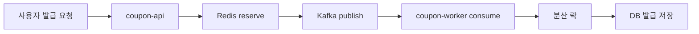
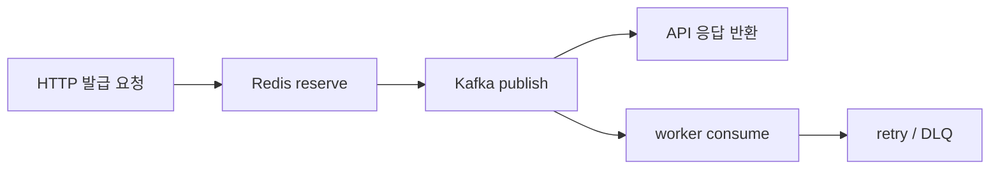
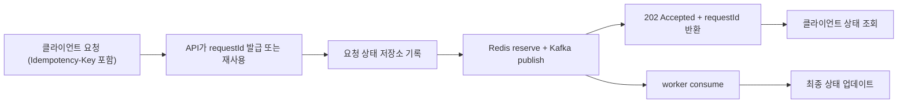
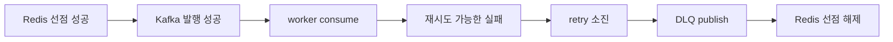

이전에는 [원자성을 고려한 Lua 스크립트](https://www.ybchar.dev/tech-blog/20260412_lua_script) 글을 작성해보았는데요, 이번에는 “이 시스템이 몇 명까지 버티는가”를 한 문장으로 요약하기보다 어떠한 시나리오를 가지고 `k6` 부하테스트를 진행해보았는지부터 차례대로 정리해보려 합니다.

쿠폰 시스템은 평소처럼 완만한 요청이 들어오는 순간도 있지만, 같은 쿠폰 하나에 사용자가 짧은 시간 동안 한꺼번에 몰리는 순간도 있습니다.
우리 일상에서 자주 사용하는 서비스들도 `오늘의집 블랙프라이데이`, `무신사 빅세일`, `올영세일`처럼 선착순 쿠폰이나 이벤트로 갑작스럽게 트래픽이 몰리는 경우가 많습니다. 이런 순간에 서버 개발자가 정말 알고 싶은 것은 “CPU를 몇 개 더 붙이면 된다”보다, “어떤 패턴의 트래픽에서 어디가 먼저 흔들리는가”에 더 가깝다고 생각했습니다.

그래서 한 가지 부하테스트만으로는 시스템을 설명하기 어렵다고 봤고, 일반 사용량, sustained intake, 대량 동시 발급 정합성 확인을 각각 다른 시나리오로 나눠서 봤습니다.
그리고 여기서 끝내지 않고, 이 결과를 실제 운영 판단으로 어떻게 연결할 수 있는지도 함께 적어보려 합니다.

이번 측정은 `2Core 8GB` 클라우드 환경에서 `coupon-api`에 `1Core`를 할당한 상태로 진행했습니다.
다만 이 글은 “이 스펙에서 몇 명까지 된다”를 말하려는 글은 아닙니다. 같은 서비스를 운영해도 어떤 팀은 단일 인스턴스를 쓸 수 있고, 어떤 팀은 쿠버네티스 기반 분산 환경을 쓸 수 있기 때문입니다.
그래서 이번 글에서는 특정 VM 사양보다 `어떤 트래픽 패턴에서 어떤 배포 구성을 고민해야 하는가`에 더 무게를 두었습니다.

## 먼저 고정한 해석 기준

이 글에서는 `POST /coupon-issues`의 `SUCCESS`를 최종 DB 저장 완료로 보지 않습니다.

현재 구현의 런타임 흐름은 아래와 같습니다.



즉, `SUCCESS`는 `Redis reserve + Kafka broker ack`가 끝났다는 뜻이고, 최종 DB 반영은 worker가 뒤에서 비동기로 처리합니다.
발급 API를 호출했다고 바로 DB에 반영되는 구조가 아닙니다.
이 기준을 먼저 고정해두지 않으면, 응답 성공과 최종 정합성을 같은 것으로 읽어버리기 쉽습니다.

## 측정 당시 참고 환경

이번 측정은 아래와 같은 환경에서 진행했습니다.
다만 이 환경은 “정답 스펙”이라기보다, 결과를 읽기 위한 참고 좌표로 보는 편이 맞습니다.

- `coupon-app`: `1 CPU`, `mem_limit 1536m`, `mem_reservation 768m`, `-Xmx768m`
- `coupon-worker`: `0.5 CPU`, `mem_limit 896m`, `mem_reservation 384m`, `concurrency 1`, `permits 60/s`
- 같은 호스트에 `MySQL`, `Redis`, `Kafka`, `Grafana`, `Loki`, `InfluxDB`, `Kafka UI`도 함께 올라가 있었습니다
- 공개 경로는 `https://coupon-api.yogieat.com -> Nginx -> app(18080)` 이었습니다

즉, 아래 수치는 앱만 따로 떼어낸 순수 벤치마크가 아니라, 비교적 현실적인 운영 조건에서 관찰된 결과입니다.
이 글에서 중요한 것은 `정확히 같은 스펙에서 몇 명까지`가 아니라, `어떤 트래픽 패턴에서 어떤 병목이 먼저 보였는가`입니다.


## 어떠한 시나리오를 가지고 k6 부하테스트를 진행해보았는가

아래는 실제로 사용한 시나리오들입니다.
각 시나리오마다 같은 형식으로 정리했습니다.

- 명령어
- 시나리오 설명
- 실행 결과 이미지
- 관찰한 결과

가능하면 바로 복붙해서 다시 실행할 수 있도록, 명령어도 줄바꿈 형태로 통일했습니다.

### 시나리오 1. 일반 사용량 기준 부하

#### 명령어

```bash
node load-test/k6/run-with-slack.mjs baseline --profile prod -- \
  -e 'BASE_URL=https://coupon-api.yogieat.com' \
  -e 'ADMIN_EMAIL=<ADMIN_EMAIL>' \
  -e 'ADMIN_PASSWORD=<ADMIN_PASSWORD>' \
  -e 'BASELINE_VUS=15' \
  -e 'BASELINE_DURATION=10m' \
  -e 'BASELINE_SESSION_POOL_SIZE=60' \
  -e 'BASELINE_COUPON_POOL_SIZE=10'
```

#### 시나리오 설명

이 시나리오는 평소 운영에 가까운 완만한 부하를 가정합니다.
극단적인 경합보다 먼저, 현재 배포한 코드가 일반적인 사용 패턴에서 끝까지 안정적으로 수행되는지를 보기 위한 기준선입니다.

#### 실행 결과 이미지

<div style={{ display: 'grid', gridTemplateColumns: 'repeat(auto-fit, minmax(280px, 1fr))', gap: '12px', width: '100%' }}>
  
</div>

#### 관찰한 결과

- 결과: 성공
- 부하 조건: `15명이 10분 동안 일반 사용 패턴으로 실행`
- p95: `143.12ms`
- 오류율: `0.00%`
- 정상 응답 확인율: `100.00%`

이 결과는 시스템이 최소한의 기준선에서는 흔들리지 않는다는 점을 보여줬습니다.
이 값을 기준으로 이후 overload, burst 결과를 비교했습니다.

### 시나리오 2. sustained intake 확인 - 90 VU

#### 명령어

```bash
node load-test/k6/run-with-slack.mjs issue-overload --profile prod -- \
  -e 'BASE_URL=https://coupon-api.yogieat.com' \
  -e 'ADMIN_EMAIL=<ADMIN_EMAIL>' \
  -e 'ADMIN_PASSWORD=<ADMIN_PASSWORD>' \
  -e 'ISSUE_OVERLOAD_VUS=90' \
  -e 'ISSUE_OVERLOAD_DURATION=2m'
```

#### 시나리오 설명

이 테스트는 최종 DB 발급 throughput이 아니라, `coupon-issues` intake 경로가 일정 시간 동안 계속 들어오는 요청을 얼마나 안정적으로 받는지를 보기 위한 시나리오입니다.
먼저 `90 VU`에서 sustained intake가 흔들리지 않는지 확인했습니다.

#### 실행 결과 이미지

<div style={{ display: 'grid', gridTemplateColumns: 'repeat(auto-fit, minmax(280px, 1fr))', gap: '12px', width: '100%' }}>
  
</div>

#### 관찰한 결과

- 결과: 통과
- 부하 조건: `90 VU / 2m`
- p95: `462.83ms`
- unexpected failure: `0`

이번 측정에서는 `90 VU`까지도 통과했습니다.
그래서 sustained intake 경계를 더 위로 밀어봐도 된다고 판단했습니다.

### 시나리오 3. sustained intake 확인 - 100 VU

#### 명령어

```bash
node load-test/k6/run-with-slack.mjs issue-overload --profile prod -- \
  -e 'BASE_URL=https://coupon-api.yogieat.com' \
  -e 'ADMIN_EMAIL=<ADMIN_EMAIL>' \
  -e 'ADMIN_PASSWORD=<ADMIN_PASSWORD>' \
  -e 'ISSUE_OVERLOAD_VUS=100' \
  -e 'ISSUE_OVERLOAD_DURATION=2m'
```

#### 시나리오 설명

`90 VU`를 통과한 뒤, 현재 배포 형태에서 sustained intake 상한을 조금 더 밀어보기 위한 케이스입니다.
순간 burst가 아니라 2분 동안 계속 요청이 들어오는 상황에서 `100 VU`가 안정적으로 유지되는지를 확인했습니다.

#### 실행 결과 이미지

<div style={{ display: 'grid', gridTemplateColumns: 'repeat(auto-fit, minmax(280px, 1fr))', gap: '12px', width: '100%' }}>
  
</div>

#### 관찰한 결과

- 결과: 통과
- 부하 조건: `100 VU / 2m`
- p95: `450.03ms`
- unexpected failure: `0`

이번 측정 기준으로는 `100 VU`까지도 큰 흔들림 없이 통과했습니다.
이 지점부터는 단순히 “되는가”보다 “어디서부터 실패가 나타나는가”를 더 보고 싶어졌습니다.

### 시나리오 4. sustained intake 확인 - 110 VU

#### 명령어

```bash
node load-test/k6/run-with-slack.mjs issue-overload --profile prod -- \
  -e 'BASE_URL=https://coupon-api.yogieat.com' \
  -e 'ADMIN_EMAIL=<ADMIN_EMAIL>' \
  -e 'ADMIN_PASSWORD=<ADMIN_PASSWORD>' \
  -e 'ISSUE_OVERLOAD_VUS=110' \
  -e 'ISSUE_OVERLOAD_DURATION=2m'
```

#### 시나리오 설명

이 케이스는 `100 VU`를 넘긴 뒤에도 sustained intake가 유지되는지 확인하기 위한 경계 탐색입니다.
제가 확인하고 싶었던 것은 “100 VU가 우연히 통과한 값인가”, 아니면 “그보다 조금 더 높은 구간도 운영 후보로 볼 수 있는가”였습니다.

#### 실행 결과 이미지

<div style={{ display: 'grid', gridTemplateColumns: 'repeat(auto-fit, minmax(280px, 1fr))', gap: '12px', width: '100%' }}>
  
</div>

#### 관찰한 결과

- 결과: 통과
- 부하 조건: `110 VU / 2m`
- p95: `485.58ms`
- unexpected failure: `0`

`110 VU`까지도 기준을 만족했습니다.
다만 p95가 `90~100 VU` 구간보다 높아졌기 때문에, 여유가 넓다고 보기보다는 다음 단계에서 실패 경계를 확인해야 하는 상태로 읽었습니다.

### 시나리오 5. sustained intake 확인 - 120 VU

#### 명령어

```bash
node load-test/k6/run-with-slack.mjs issue-overload --profile prod -- \
  -e 'BASE_URL=https://coupon-api.yogieat.com' \
  -e 'ADMIN_EMAIL=<ADMIN_EMAIL>' \
  -e 'ADMIN_PASSWORD=<ADMIN_PASSWORD>' \
  -e 'ISSUE_OVERLOAD_VUS=120' \
  -e 'ISSUE_OVERLOAD_DURATION=2m'
```

#### 시나리오 설명

`110 VU`까지 통과한 뒤, 현재 배포 형태의 sustained intake 경계가 어디서 깨지는지를 확인하기 위해 `120 VU`까지 올렸습니다.
이 시나리오는 “최대 몇 명까지 성공했는가”보다 “어느 지점부터 운영 기준을 만족하지 못하는가”를 확인하기 위한 테스트였습니다.

#### 실행 결과 이미지

<div style={{ display: 'grid', gridTemplateColumns: 'repeat(auto-fit, minmax(280px, 1fr))', gap: '12px', width: '100%' }}>
  
</div>

#### 관찰한 결과

- 결과: 실패
- 부하 조건: `120 VU / 2m`
- 실패 신호: 미리 정한 정상 응답 또는 오류율 기준 미달

이번 측정에서는 `110 VU`까지는 통과했지만, `120 VU`에서는 기준을 만족하지 못했습니다.
그래서 현재 배포 형태의 sustained intake 경계는 `110 VU`와 `120 VU` 사이에 있다고 보는 편이 가장 합리적이었습니다.

### 시나리오 6. 대량 동시 발급 정합성 확인 - 800명 / 재고 1

#### 명령어

```bash
node load-test/k6/run-with-slack.mjs issue-burst --profile prod -- \
  -e 'BASE_URL=https://coupon-api.yogieat.com' \
  -e 'ADMIN_EMAIL=<ADMIN_EMAIL>' \
  -e 'ADMIN_PASSWORD=<ADMIN_PASSWORD>' \
  -e 'ISSUE_BURST_VUS=800' \
  -e 'ISSUE_BURST_STOCK=1' \
  -e 'ISSUE_BURST_MAX_DURATION=5m' \
  -e 'ISSUE_POLL_TIMEOUT_SECONDS=60' \
  -e 'ISSUE_SETTLEMENT_TIMEOUT_SECONDS=180'
```

#### 시나리오 설명

이 시나리오는 같은 쿠폰 하나에 `800명`이 동시에 1회 발급을 시도하는 상황입니다.
재고는 `1개`이므로, 기대하는 최종 상태는 단순합니다.

- 최종 발급 건수 `1`
- 최종 잔여 재고 `0`

즉, 응답 시간이 조금 느리더라도 먼저 확인하고 싶은 것은 과발급이 일어나지 않는가였습니다.

#### 실행 결과 이미지

<div style={{ display: 'grid', gridTemplateColumns: 'repeat(auto-fit, minmax(280px, 1fr))', gap: '12px', width: '100%' }}>
  
</div>

#### 관찰한 결과

- 결과: 성공
- 부하 조건: `800명이 같은 쿠폰에 동시에 1회 발급 요청`
- p95: `1437.71ms`
- 오류율: `0.00%`
- 정상 응답 확인율: `100.00%`
- 성공 발급 건수: `1`
- 재고 부족 건수: `799`
- 전송 계층 오류 건수: `0`
- 예상 밖 응답 오류 건수: `0`
- 서버 오류 건수: `0`
- 최종 발급 건수: `1`
- 최종 잔여 재고: `0`
- 재고 정합성 검증: `100.00%`

이번 측정에서는 `800명 / 재고 1` 시나리오가 기준을 충족했습니다.
정합성뿐 아니라 응답 품질 기준도 무너지지 않았습니다.

### 시나리오 7. 대량 동시 발급 정합성 확인 - 900명 / 재고 1, 개선 후 재실행

#### 명령어

```bash
node load-test/k6/run-with-slack.mjs issue-burst --profile prod -- \
  -e 'BASE_URL=https://coupon-api.yogieat.com' \
  -e 'ADMIN_EMAIL=<ADMIN_EMAIL>' \
  -e 'ADMIN_PASSWORD=<ADMIN_PASSWORD>' \
  -e 'ISSUE_BURST_VUS=900' \
  -e 'ISSUE_BURST_STOCK=1' \
  -e 'ISSUE_BURST_MAX_DURATION=5m' \
  -e 'ISSUE_POLL_TIMEOUT_SECONDS=60' \
  -e 'ISSUE_SETTLEMENT_TIMEOUT_SECONDS=180'
```

#### 시나리오 설명

이 테스트는 바로 직전 `800명` 시나리오에서 한 단계 더 올린 경계 탐색이면서, 동시에 개선 작업 이후 동일 시나리오를 다시 측정한 재실행이기도 합니다.
같은 공개 경로, 같은 재고, 거의 같은 조건에서 사용자 수만 늘렸을 때 어떤 변화가 생기는지, 그리고 hot path 최적화가 실제로 어떤 차이를 만들었는지 보고 싶었습니다.

#### 실행 결과 이미지

<div style={{ display: 'grid', gridTemplateColumns: 'repeat(auto-fit, minmax(280px, 1fr))', gap: '12px', width: '100%' }}>
  
</div>

#### 관찰한 결과

- 결과: 성공
- 부하 조건: `900명이 같은 쿠폰에 동시에 1회 발급 요청`
- p95: `773.13ms`
- 오류율: `0.00%`
- 정상 응답 확인율: `100.00%`
- 성공 발급 건수: `1`
- 재고 부족 건수: `899`
- 전송 계층 오류 건수: `0`
- 예상 밖 응답 오류 건수: `0`
- 서버 오류 건수: `0`
- 최종 발급 건수: `1`
- 최종 잔여 재고: `0`
- 재고 정합성 검증: `100.00%`
- 예상 결과 검증: `100.00%`

이 결과가 흥미로웠던 이유는, 같은 `900명 / 재고 1` 시나리오가 개선 전과는 다른 모양으로 끝났기 때문입니다.

최종 발급 건수와 잔여 재고는 여전히 기대값과 일치했습니다.
즉, 과발급은 일어나지 않았고 정합성도 유지됐습니다.

그리고 이번에는 테스트 판정도 성공이었습니다.
`정상 응답 확인율`, `오류율`, `전송 계층 오류`, `예상 밖 응답 오류` 기준까지 모두 통과했습니다.

즉, 개선 전에는 같은 `900명 / 재고 1`에서 응답 품질이 먼저 흔들렸고, 개선 후에는 그 경계를 다시 안쪽으로 밀어낸 셈이었습니다.

이번 결과는 “정합성 레이어가 맞았는가”뿐 아니라, “응답 경로에서 어떤 비용을 덜어내면 실제로 같은 시나리오를 통과시킬 수 있는가”도 함께 보여줬습니다.

### 시나리오 8. 대량 동시 발급 정합성 확인 - 1000명 / 재고 1

#### 명령어

```bash
node load-test/k6/run-with-slack.mjs issue-burst --profile prod -- \
  -e 'BASE_URL=https://coupon-api.yogieat.com' \
  -e 'ADMIN_EMAIL=<ADMIN_EMAIL>' \
  -e 'ADMIN_PASSWORD=<ADMIN_PASSWORD>' \
  -e 'ISSUE_BURST_VUS=1000' \
  -e 'ISSUE_BURST_STOCK=1' \
  -e 'ISSUE_BURST_MAX_DURATION=5m' \
  -e 'ISSUE_POLL_TIMEOUT_SECONDS=60' \
  -e 'ISSUE_SETTLEMENT_TIMEOUT_SECONDS=180'
```

#### 시나리오 설명

이 시나리오는 개선 이후 경계가 정말 넓어졌는지 확인하기 위해, 같은 공개 경로와 같은 재고 조건에서 동시 사용자 수를 `1000명`까지 올린 재측정입니다.
즉, `900명 성공`이 단순한 우연이 아니라 실제 headroom 확장인지 확인하는 단계였습니다.

#### 실행 결과 이미지

<div style={{ display: 'grid', gridTemplateColumns: 'repeat(auto-fit, minmax(280px, 1fr))', gap: '12px', width: '100%' }}>
  
</div>

#### 관찰한 결과

- 결과: 실패
- 부하 조건: `1000명이 같은 쿠폰에 동시에 1회 발급 요청`
- p95: `777.60ms`
- 오류율: `1.99%`
- 정상 응답 확인율: `98.05%`
- 성공 발급 건수: `1`
- 재고 부족 건수: `959`
- 전송 계층 오류 건수: `0`
- 예상 밖 응답 오류 건수: `0`
- 서버 오류 건수: `40`
- 최종 발급 건수: `1`
- 최종 잔여 재고: `0`
- 재고 정합성 검증: `100.00%`
- 예상 결과 검증: `100.00%`

이번 재측정에서는 다시 실패 판정이 나왔습니다.
다만 실패의 모양은 과발급이 아니라, `5xx` 계열 서버 오류가 기준을 넘어서면서 나온 실패였습니다.

즉, 개선 작업으로 `900명 / 재고 1`은 통과시켰지만, 같은 공개 진입 경로에서 `1000명 / 재고 1`까지는 아직 headroom이 충분하지 않았습니다.
정합성은 끝까지 유지됐고, 다시 드러난 것은 공개 응답 경로의 품질 경계였습니다.

## 시나리오를 나란히 놓고 보니

이번 결과를 시나리오별로 나열해보니 현재 환경의 경계가 더 선명하게 보였습니다.


- 일반 사용량 기준 부하는 충분히 안정적이었습니다
- sustained intake는 `90`, `100`, `110 VU`까지 통과했습니다
- `120 VU`에서는 미리 정한 성능 기준을 만족하지 못했습니다
- 대량 동시 발급에서는 `800명 / 재고 1`, 개선 후 `900명 / 재고 1`은 통과했지만, `1000명 / 재고 1`에서는 다시 실패했습니다
- 다만 `1000명 / 재고 1`에서도 최종 발급 건수와 잔여 재고는 기대값과 일치했습니다
- 즉 이전 경계는 정합성 한계라기보다, 공개 진입 경로의 응답 품질 경계에 더 가까웠습니다

그래서 이번 글의 핵심 문장은 조금 더 구체적으로 정리할 수 있게 됐습니다.
개선 전에는 `900명 / 재고 1`에서 정합성보다 공개 진입 경로의 응답 품질이 먼저 무너졌고, 개선 후에는 `900명`까지는 다시 통과시킬 수 있었습니다.
하지만 `1000명 / 재고 1`에서는 서버 오류가 다시 나타났기 때문에, 이번 개선은 경계를 없앤 것이 아니라 `900명에서 1000명 사이`로 옮긴 작업으로 읽는 편이 더 정확했습니다.
그리고 sustained intake 기준으로도 `110 VU`까지는 통과했지만 `120 VU`에서 실패했으므로, 현재 공개 경로의 지속 처리 경계는 `110~120 VU` 사이에 있다고 보는 편이 맞았습니다.

## 왜 전송 오류는 DLQ로 해결되지 않는가

부하 테스트를 반복하다 보면 전송 계층 오류를 보게 되는 경우가 있습니다.
특히 `EOF`, `connection reset`, `request timeout`처럼 클라이언트가 응답을 받기 전에 연결이 끊긴 오류는 서버 내부 실패와 다르게 해석해야 합니다.
이때 자연스럽게 이런 질문이 나옵니다.

> `EOF`, `connection reset`, `request timeout` 같은 오류도 결국 실패인데, 이런 것도 DLQ에 넣어서 재처리하면 되는 것 아닐까?

이번 프로젝트에서는 이 둘을 분리해서 봐야 했습니다.


- `DLQ`는 Kafka 메시지가 **이미 발행된 뒤**, worker가 consume 하다가 retry를 모두 소진한 경우를 위한 경로입니다
- `EOF`, `connection reset`, `request timeout`은 클라이언트가 **HTTP 응답을 정상적으로 받지 못한 경우**입니다

현재 런타임 계약은 아래 순서로 동작합니다.



즉, DLQ는 `worker consume` 이후 실패를 다루는 장치입니다.
반대로 `EOF`, `timeout`은 그보다 앞쪽인 `HTTP 요청-응답 구간`에서 발생한 문제입니다.

여기서 중요한 점은, 전송 오류가 났다고 해서 항상 서버가 아무 일도 못 했다는 뜻은 아니라는 점입니다.

- 어떤 요청은 아예 publish 전에 끊겼을 수 있습니다
- 어떤 요청은 `Redis reserve + Kafka publish`까지는 끝났지만, 응답이 클라이언트에 도달하기 전에 연결이 끊겼을 수도 있습니다

이 두 경우는 클라이언트 입장에서는 둘 다 “응답을 못 받았다”로 보이지만, 서버 내부 상태는 전혀 다를 수 있습니다.
그래서 이 문제는 DLQ 재처리보다 `수락 여부를 어떻게 재확인하게 만들 것인가`의 문제에 더 가깝습니다.

현재 구조에서는 `SUCCESS`가 `Redis reserve + Kafka broker ack`를 의미하고, durable acceptance layer는 아직 없습니다.
그래서 전송 오류를 “나중에 서버가 알아서 복구한다”기보다, 클라이언트 재시도와 중복 방지, 상태 조회 전략으로 풀어야 하는 영역에 가깝습니다.

## 그렇다면 서버에서는 어떻게 줄일 수 있을까

전송 오류나 서버 오류처럼 공개 응답 경로에서 드러나는 문제는 크게 세 층으로 나눠서 봤습니다.

### 1. 응답이 끊기기 전에 더 빨리, 더 가볍게 끝내기

이건 이번에 실제로 먼저 손본 부분입니다.

- 발급 hot path의 request logging을 줄였습니다
- controller stopwatch info logging도 발급 hot path에서는 생략하도록 바꿨습니다
- 쿠폰 활성화 시점에 issue detail cache와 Redis issue state를 prewarm 하도록 넣었습니다

즉, burst 첫 요청에서 cache miss, Redis rebuild, 과도한 request log가 한 번에 겹치지 않도록 만든 것입니다.
이런 변경은 “전송 오류를 재처리”하는 방식이 아니라, 애초에 연결이 끊길 가능성을 낮추는 방식입니다.

실제로 같은 `900명 / 재고 1` 시나리오를 다시 실행했을 때 아래처럼 바뀌었습니다.

- `정상 응답 확인율`: `96.43% -> 100.00%`
- `오류율`: `3.71% -> 0.00%`
- `p95`: `6280.48ms -> 773.13ms`
- `전송 계층 오류 건수`: `0`
- `예상 밖 응답 오류 건수`: `0`

즉, 이번 개선은 “코드를 조금 정리했다” 수준이 아니라, 실제로 동일 시나리오의 통과 여부를 바꾼 작업이었습니다.

다만 여기서 결론을 너무 빨리 내리면 안 됐습니다.
같은 개선 이후 `1000명 / 재고 1`을 다시 밀어보니 아래처럼 경계가 다시 드러났기 때문입니다.

- `정상 응답 확인율`: `100.00% -> 98.05%`
- `오류율`: `0.00% -> 1.99%`
- `p95`: `773.13ms -> 777.60ms`
- `서버 오류 건수`: `0 -> 40`

즉, 이번 개선은 분명 효과가 있었지만, `900명`을 통과시켰다고 해서 바로 `1000명`까지 충분한 여유를 확보한 것은 아니었습니다.
지금 상태에서는 `900명`까지는 버티지만, `1000명`에서는 다시 공개 응답 경로의 headroom 부족이 드러난다고 보는 편이 맞습니다.
특히 이 결과는 p95만 보면 큰 차이가 없어 보일 수 있지만, 오류율과 서버 오류 건수를 같이 보면 운영 기준을 만족하지 못한 케이스였습니다.

### 2. 응답을 놓쳐도 상태를 다시 확인할 수 있게 만들기

이건 다음 단계에서 더 고민할 수 있는 영역입니다.

- idempotency key 또는 requestId 기반 재시도
- “이 요청이 이미 수락되었는가”를 조회하는 상태 확인 API
- 비동기 수락 모델을 더 명확히 드러내는 request-status 패턴
- 더 강하게 가면 request table + relay + CDC 같은 durable acceptance layer

특히 `EOF`처럼 “서버는 처리했을 수도 있지만 클라이언트는 결과를 못 받은” 상황에서는, 단순 재시도만으로는 중복 요청과 구분이 어렵습니다.
그래서 장기적으로는 `재시도 가능성`과 `상태 재확인 가능성`을 같이 설계하는 편이 더 안전합니다.

### 2-1. 지금 구조에서 가장 자연스러운 다음 단계는 requestId 승격입니다

현재 구현에도 `requestId` 자체는 이미 있습니다.
`coupon-api`는 intake 시점에 requestId를 만들고, Kafka 메시지에도 같이 실어 worker 로그와 연결합니다.

다만 지금의 `requestId`는 내부 추적용에 가깝습니다.
즉, 서버 로그와 worker 로그를 한 요청으로 묶는 데는 유용하지만, 클라이언트가 “내 요청이 수락되었는가”를 다시 확인하는 계약으로까지 올라와 있지는 않습니다.

그래서 다음 단계로 가장 먼저 떠올린 건 `requestId`를 API 계약으로 승격하는 방식이었습니다.
모양은 대략 이렇습니다.




여기서 핵심은 세 가지입니다.

- 클라이언트는 요청마다 `Idempotency-Key`를 보냅니다
- 서버는 그 키와 연결된 `requestId`를 저장합니다
- 응답을 놓친 클라이언트는 같은 키로 재시도하거나, `requestId`로 상태를 조회할 수 있어야 합니다

이 방식의 장점은 단순합니다.
전송 오류가 났을 때도 클라이언트는 “다시 같은 요청을 보내도 되는가”와 “이미 수락된 요청인가”를 구분할 수 있습니다.

예를 들면 이런 흐름입니다.

1. 클라이언트가 `POST /coupon-issues`와 함께 `Idempotency-Key`를 보냅니다
2. 서버는 이 키를 request 상태 저장소에 기록합니다
3. Redis reserve와 Kafka publish가 끝나면 `202 Accepted`와 함께 `requestId`를 반환합니다
4. 만약 응답 전에 연결이 끊기면, 클라이언트는 같은 `Idempotency-Key`로 다시 요청하거나 `requestId`로 상태를 조회합니다
5. 서버는 새로 처리하지 않고, 이미 수락된 요청이면 같은 수락 상태를 돌려줍니다

즉, 이 구조에서는 전송 오류가 나더라도 “다시 시도했더니 중복 발급이 난다”는 식의 불안정한 UX를 크게 줄일 수 있습니다.

### 2-2. 상태 저장소는 처음부터 거창할 필요는 없습니다

여기서 바로 `request table + relay + CDC`까지 가야 하는 것은 아닙니다.
현재 구조를 크게 흔들지 않으면서도, 한 단계씩 갈 수 있습니다.

첫 단계:

- Redis에 짧은 TTL의 `request status`를 둔다
- 상태는 `RECEIVED`, `ACCEPTED`, `SUCCEEDED`, `REJECTED`, `DLQ` 정도로 단순화한다
- `requestId`와 `Idempotency-Key`를 함께 매핑한다

이 정도만 해도 클라이언트는 “응답은 못 받았지만 이미 수락된 요청인가”를 다시 확인할 수 있습니다.

그 다음 단계:

- request 상태를 더 오래 보존해야 한다면 DB request table 도입
- replay나 audit이 중요해지면 relay/CDC까지 검토

즉, 이번 글의 맥락에서 중요한 것은 “전송 오류를 무조건 DLQ로 재처리한다”가 아니라, “전송 오류 이후에도 같은 요청을 식별하고 상태를 다시 설명할 수 있는가”였습니다.

### 3. 인프라 계층에서 연결 안정성을 높이기

애플리케이션 코드만으로는 한계가 있어서, 운영 계층도 같이 봐야 합니다.

- API scale-up보다 먼저 LB 뒤 API scale-out을 고려하기
- 프록시 timeout, keep-alive, connection 재사용 정책 점검
- observability stack과 app runtime을 같은 노드에서 분리하기
- Redis/Kafka/MySQL을 외부 관리형 또는 별도 계층으로 분리하기

개선 전 측정에서 정합성은 유지됐는데 응답 품질이 먼저 무너졌고, 개선 후에는 같은 시나리오가 다시 통과했기 때문에, 결국 전송 오류는 “비즈니스 로직이 틀렸다”보다 “공개 진입 경로가 과부하를 얼마나 부드럽게 흡수하느냐”의 문제로 읽는 편이 맞았습니다.

## 그렇다면 어떤 트래픽에서 어떤 스펙이나 구성을 고민해야 할까

여기서부터는 “이 VM에서 몇 명까지”가 아니라, 이번 측정 결과를 운영 판단으로 바꾸는 구간입니다.
정확한 사양은 애플리케이션 코드, DB 종류, 프록시, 관측성 스택 동거 여부에 따라 달라지기 때문에 절대값으로 적기보다, 트래픽 패턴별로 어떤 구성을 먼저 고려해야 하는지 정리하는 편이 더 유용하다고 봤습니다.

### 트래픽별 운영 판단표


| 예상 트래픽 패턴 | 이번 측정에서 보인 신호 | 먼저 고려할 구성 | 이유 |
| --- | --- | --- | --- |
| 일반적인 일상 트래픽 | `baseline 15 VU / 10m` 안정 통과 | 단일 API 인스턴스 + 단일 worker + 외부 Redis/Kafka 또는 분리된 데이터 계층 | 기능 회귀와 완만한 요청에서는 큰 흔들림이 없었기 때문입니다 |
| 일정 시간 지속되는 발급 집중 | `issue-overload 90~110 VU`는 통과, `120 VU`에서 실패 | API 인스턴스 CPU 상향 또는 API 2 replicas 이상, worker와 observability 분리 | sustained intake에서는 `110 VU`까지는 버텼지만, 바로 다음 구간인 `120 VU`에서 기준 미달이 발생했기 때문입니다 |
| 특정 쿠폰에 짧은 시간 동안 대량 경합 | `800명 / 재고 1`, 개선 후 `900명 / 재고 1`은 통과했지만 `1000명 / 재고 1`에서는 서버 오류 `40건`으로 실패 | LB 뒤 API scale-out 가능 구조, hot path logging 축소, activation 시점 prewarm | 같은 경합 시나리오도 응답 경로 비용을 줄이면 분명 좋아지지만, 현재 공개 경로 headroom은 `900명과 1000명 사이`에 있다고 읽는 편이 맞기 때문입니다 |
| 캠페인성 대량 유입이 자주 반복되는 환경 | `1000명 / 재고 1`에서 오류율 `1.99%`, 정상 응답 확인율 `98.05%`, 서버 오류 `40건` | API 다중 replica, worker 병렬도 조정, Redis/Kafka/DB를 외부 관리형으로 분리, 사전 warming 절차 도입 | 반복적인 캠페인 환경에서는 “한 번 통과했다”보다 “경계 바깥에서 어떻게 무너지는가”가 더 중요해서, 지금은 scale-out과 infra 분리가 먼저 필요한 상태로 보였습니다 |

위 표를 한 문장으로 요약하면 이렇습니다.
평소 트래픽은 단일 인스턴스도 운영 가능할 수 있지만, 캠페인성 발급이 들어오는 순간부터는 `API scale-up`보다 `API scale-out + shared infra 분리` 관점이 더 중요해집니다.

### 제가 이번 결과로 잡은 실무 기준

이번 프로젝트에서는 아래처럼 읽는 편이 가장 현실적이었습니다.

- 완만한 일상 트래픽만 다룬다면, 단일 API 인스턴스도 출발점이 될 수 있습니다
- 발급 요청이 일정 시간 몰리는 서비스라면, 최소한 API와 worker를 분리해서 생각해야 합니다
- 특정 쿠폰 하나에 요청이 몰리는 프로모션이 있다면, hot path 최적화만으로도 `900명` 경계는 넘길 수 있었지만 `1000명`에서는 다시 실패했기 때문에, 운영 기준으로는 여전히 API scale-out 가능 구조를 먼저 준비하는 편이 안전합니다
- Redis, Kafka, MySQL, Grafana까지 같은 호스트에 올린 상태의 수치는 보수적으로 읽어야 합니다
- 실제 운영 스펙을 정할 때는 `몇 코어냐`보다 `어떤 트래픽 패턴을 견뎌야 하느냐`를 먼저 정하는 편이 훨씬 중요했습니다

## 그 판단을 왜 그렇게 했는가

글을 여기까지 읽으면 자연스럽게 이런 질문이 생깁니다.

> 왜 저는 `정합성 문제`보다 `공개 진입 경로의 응답 품질 문제`로 읽었을까?  
> 왜 `DLQ`보다 `hot path 최적화`와 `API scale-out`을 먼저 이야기했을까?

이번 글에서 내린 판단은 느낌이 아니라, 아래처럼 측정값과 런타임 계약을 같이 놓고 결정한 것이었습니다.

### 이번 글에서 실제로 한 판단

| 판단 | 그렇게 읽은 근거 | 이번 측정에서 본 신호 |
| --- | --- | --- |
| 이번 실패의 핵심은 정합성보다 응답 품질이다 | 최종 상태가 기대값과 같다면, 실패 원인을 먼저 응답 경로에서 찾아보는 편이 더 합리적입니다 | `900명 / 재고 1`, `1000명 / 재고 1` 모두 `최종 발급 1`, `최종 잔여 재고 0`, `재고 정합성 100.00%` |
| 전송 오류는 DLQ보다 intake 경로 문제에 가깝다 | DLQ는 Kafka에 메시지가 들어간 뒤 worker가 retry를 소진했을 때의 장치이기 때문입니다 | `EOF`, `connection reset`, `request timeout`은 HTTP 요청-응답 구간의 실패입니다 |
| worker 튜닝보다 hot path 최적화를 먼저 봤다 | `재고 1` 시나리오에서는 결국 성공 처리 자체는 `1건`만 일어나므로, 병목이 항상 worker 처리량일 것이라고 보기 어렵습니다 | 같은 계열 시나리오에서 logging 축소 + prewarm 이후 `900명 / 재고 1`이 다시 통과 |
| 이번 개선은 효과가 있었지만 구조적 여유까지 확보한 것은 아니다 | 한 번 통과한 시나리오보다, 바로 다음 경계에서 다시 어떻게 깨지는지가 더 중요합니다 | `900명 / 재고 1` 성공, `1000명 / 재고 1` 실패, `서버 오류 0 -> 40` |
| 운영 권장안은 scale-up보다 scale-out 우선이다 | 같은 공개 경로에서 경계를 넘기면 응답 품질이 다시 먼저 깨졌기 때문입니다 | sustained intake는 `110~120 VU` 사이, burst는 `900~1000명` 사이에서 경계가 드러났습니다 |

즉, 이번 글에서의 의사결정은 “무슨 기술이 멋져 보여서”가 아니라, 아래 순서로 정리된 셈이었습니다.

1. 최종 상태가 맞는가를 먼저 본다.
2. 최종 상태가 맞다면 실패 원인을 정합성보다 응답 경로에서 먼저 찾는다.
3. 응답 경로 문제라면, 더 뒤쪽 worker보다 공개 진입 hot path 비용부터 줄여본다.
4. 같은 개선 뒤에도 다음 경계에서 다시 깨지면, 그때는 구조적인 scale-out과 infra 분리를 우선순위로 올린다.

### 그래서 이번 글에서는 이런 선택을 먼저 말했다

이번 글에서 제가 `hot path logging 축소`, `prewarm`, `API scale-out`, `requestId / Idempotency-Key`를 먼저 이야기한 이유도 같은 맥락입니다.

- `hot path logging 축소`
  발급 요청마다 남기던 부하를 실제로 줄였을 때 `900명 / 재고 1`이 통과로 바뀌었기 때문입니다
- `prewarm`
  첫 경합에서 cache miss와 issue state 초기화 비용이 겹치는 구조를 줄이는 것이 공개 진입 경로에 직접적이었기 때문입니다
- `API scale-out`
  `1000명 / 재고 1`에서 다시 무너진 지점이 worker 내부 정합성보다 공개 응답 품질이었기 때문입니다
- `requestId / Idempotency-Key`
  전송 오류는 “처리가 안 된 요청”과 “처리는 됐지만 응답을 못 받은 요청”이 섞일 수 있어서, 상태 재확인 계약이 필요했기 때문입니다

결국 이번 글의 의사결정은 “어떤 기술을 더 붙일까”보다 “이번 숫자가 어디를 먼저 가리키는가”에 가까웠습니다.
그래서 저는 더 복잡한 retry/DLQ 설계보다, 먼저 응답 경로 비용과 공개 진입 구조를 손보는 쪽을 앞에 두는 편이 더 합리적이라고 판단했습니다.

## 어떤 실패가 DLQ로 가고, 어떤 실패는 가지 않는가

부하 테스트를 더 돌려보니 제가 처음 “추가로 확인하면 좋겠다”고 적었던 시나리오들도 대부분 실패 케이스로 바뀌었습니다.
그런데 이 실패들이 모두 `coupon.issue.v1.dlq`에 쌓이는 것은 아니었습니다.
처음에는 저도 “실패했는데 왜 DLQ가 안 늘지?”라고 생각했지만, 코드를 따라가 보니 DLQ의 범위는 생각보다 좁고 명확했습니다.

현재 구현에서 DLQ는 아래 구간의 실패만 다룹니다.



즉, DLQ는 “사용자 요청이 실패했다”를 모두 담는 쓰레기통이 아닙니다.
Kafka에 들어간 메시지를 worker가 처리하다가, 재시도 가능한 실패를 반복한 끝에 더 이상 처리할 수 없을 때 도착하는 마지막 보상 경로입니다.

### DLQ로 가는 Retry 분기

현재 worker는 메시지를 처리한 뒤 결과를 `Succeeded`, `AlreadyIssued`, `Rejected`, `Retry`로 나눕니다.
이 중에서 DLQ로 이어질 수 있는 것은 `Retry`입니다.
`Retry`가 되면 listener가 `CouponIssueKafkaRetryableException`을 던지고, Kafka error handler가 재시도합니다.
재시도가 모두 소진되면 `DeadLetterPublishingRecoverer`가 `coupon.issue.v1.dlq`로 메시지를 보냅니다.

현재 코드 기준으로 DLQ로 이어질 수 있는 대표 조건은 아래와 같습니다.

| 조건 | 왜 Retry인가 | DLQ까지 가는 흐름 |
| --- | --- | --- |
| `LOCK_ACQUISITION_FAILED` | 분산 락을 얻지 못한 일시적 실패로 보기 때문입니다 | worker가 retry exception을 던지고, retry 소진 후 DLQ |
| terminal reject 목록에 없는 `ErrorException` | 명확히 거절 가능한 비즈니스 실패로 분류되지 않았기 때문입니다 | retry 대상이 되고, 계속 실패하면 DLQ |
| worker 처리 중 발생한 일반 `Exception` | DB, Redis, 런타임 예외처럼 일시 장애일 수 있기 때문입니다 | retry 대상이 되고, 계속 실패하면 DLQ |
| `couponIssueProcessingLimiter.acquire()` 예외 | worker consume 직후 처리량 제한을 얻는 단계에서 실패한 것이기 때문입니다 | listener 밖으로 예외가 전파되면 error handler 대상 |
| listener 내부 `IllegalArgumentException` | 현재 error handler에서 not-retryable로 등록되어 있습니다 | retry 없이 recoverer를 통해 DLQ 대상 |

여기서 중요한 점은 `LOCK_ACQUISITION_FAILED`가 곧바로 DLQ로 간다는 뜻은 아니라는 점입니다.
먼저 retry가 있고, retry가 모두 실패했을 때만 DLQ로 이동합니다.
그래서 순간적인 락 경합이 있었다고 해서 DLQ가 바로 쌓이는 구조는 아닙니다.

### DLQ로 가지 않는 실패

반대로 아래 실패들은 DLQ로 가지 않는 것이 현재 구조에서는 더 자연스럽습니다.

| 실패 유형 | DLQ로 가지 않는 이유 | 대신 봐야 할 것 |
| --- | --- | --- |
| k6 threshold 실패 | k6가 정한 성능 기준 미달일 뿐, Kafka 메시지 처리 실패가 아닙니다 | p95, 오류율, checks, 서버 로그 |
| HTTP timeout, `EOF`, `connection reset` | 클라이언트가 HTTP 응답을 받지 못한 문제입니다 | 프록시 timeout, app 리소스, requestId 기반 상태 조회 |
| API publish 실패 | Kafka에 메시지를 넣지 못했으므로 DLQ에 보낼 원본 메시지가 없습니다 | API가 Redis reserve를 즉시 release |
| worker가 떠 있지 않음 | 메시지는 main topic에 남아 있을 뿐, 소비 실패가 발생한 것이 아닙니다 | consumer lag, worker health, group 상태 |
| worker backlog가 큼 | 아직 처리 대기 중인 메시지입니다 | main topic lag, worker 처리량, DB latency |
| `SOLD_OUT`, `DUPLICATE` | Redis reserve 단계에서 즉시 판정되는 정상적인 비즈니스 결과입니다 | 응답 분포와 사용자 경험 |
| `COUPON_OUT_OF_STOCK`, `COUPON_EXPIRED`, `COUPON_NOT_ACTIVE`, `NOT_FOUND_DATA`, `NOT_FOUND_COUPON`, `INVALID_COUPON_STATUS`, `FORBIDDEN_COUPON_ISSUE`, `FORBIDDEN_ACCESS` | worker가 terminal reject로 보고 Redis reserve를 release한 뒤 ack합니다 | 비즈니스 상태와 입력 데이터 |
| `ALREADY_ISSUED_COUPON` | DB unique constraint 기반 idempotent terminal result로 봅니다 | 중복 요청 여부 |

이 목록을 보고 나면, 제가 왜 DLQ보다 응답 경로와 상태 조회를 먼저 이야기했는지가 더 분명해집니다.
예를 들어 `1000명 / 재고 100`에서 전송 계층 오류가 많이 발생해도, 그 오류는 Kafka worker retry 실패가 아닙니다.
따라서 DLQ가 쌓이지 않는 것이 이상한 게 아니라, 그 실패가 애초에 DLQ의 관할이 아닌 것입니다.

### 그럼 DLQ로 안 가는 실패도 DLQ로 보내면 좋을까?

제가 내린 결론은 “대부분은 아니다”였습니다.

DLQ는 worker가 처리하던 Kafka 메시지를 나중에 재검토하기 위한 장치입니다.
그런데 HTTP timeout이나 `EOF`는 서버가 처리했는지, Kafka publish까지 갔는지, 응답만 놓친 것인지가 클라이언트 입장에서는 섞여 보입니다.
이걸 억지로 DLQ에 넣으면 “처리되지 않은 요청”과 “이미 수락됐지만 응답만 놓친 요청”을 구분하기 더 어려워집니다.

대신 개선 방향은 실패 유형마다 달라야 한다고 봤습니다.

| 실패 유형 | DLQ로 보내기보다 먼저 할 일 |
| --- | --- |
| HTTP timeout, `EOF`, `connection reset` | `Idempotency-Key`, `requestId`, 상태 조회 API로 수락 여부를 다시 확인할 수 있게 만들기 |
| API publish 실패 | 현재처럼 Redis reserve를 release하되, publish 실패 로그와 metric을 별도로 강하게 남기기 |
| worker 미동작 | DLQ가 아니라 main topic lag와 worker health alert로 잡기 |
| worker backlog | worker replica, partition, processing limit, DB pool을 함께 조정하기 |
| terminal reject | DLQ가 아니라 reject metric과 사유별 로그로 관측하기 |

다만 한 가지 예외는 있습니다.
장기적으로 `request table + relay` 같은 durable acceptance layer를 둔다면, API가 요청을 먼저 DB에 `ACCEPTED`로 기록하고 relay가 Kafka로 발행할 수 있습니다.
이 구조에서는 Kafka publish 이전 실패도 “요청 상태”로 남길 수 있습니다.
하지만 이것은 현재 구현이 아니라 다음 단계의 구조 개선입니다.
그리고 그때도 HTTP 전송 오류를 곧바로 DLQ에 넣기보다, 요청 상태를 `RECEIVED`, `ACCEPTED`, `PUBLISHED`, `SUCCEEDED`, `REJECTED`, `FAILED`처럼 설명할 수 있게 만드는 쪽이 더 안전합니다.

결국 이번 테스트에서 DLQ가 안 쌓인 것은 “실패가 없었다”는 뜻이 아니었습니다.
실패가 DLQ로 갈 종류가 아니었다는 뜻에 가까웠습니다.
그래서 이 글에서는 DLQ를 만능 재처리 큐로 설명하지 않고, worker retry가 소진된 메시지의 보상 경로로 한정해서 보는 편이 더 정확했습니다.

## 실패 케이스를 어떻게 개선 과제로 바꿔볼 수 있을까

부하테스트를 하다 보면 실패 케이스를 단순히 “안 됐다”로 기록하고 끝내기 쉽습니다.
그런데 이번에는 실패가 오히려 다음 개선 방향을 더 선명하게 보여줬습니다.

### 1. `120 VU` 실패는 sustained intake saturation 관점으로 볼 수 있었습니다

`issue-overload`를 `90 -> 100 -> 110 -> 120 VU` 순서로 올려보니, `110 VU`까지는 통과했지만 `120 VU`에서는 기준을 만족하지 못했습니다.
이 경우는 “동시성 제어가 틀렸다”보다, 일정 시간 지속되는 발급 요청을 받아들이는 intake 경로가 현재 배포 형태의 자원 한계에 닿았다고 보는 편이 더 자연스러웠습니다.

이 실패를 개선 과제로 바꾸면 아래와 같은 질문으로 이어질 수 있습니다.

- `coupon-app`의 hot path 로깅을 줄이면 경계가 얼마나 밀릴까
- coupon detail cache, issue state를 미리 준비하면 첫 요청 비용이 줄어들까
- 같은 VM에서 observability stack을 분리하면 headroom이 얼마나 늘어날까
- API 인스턴스를 여러 개로 나누면 `110~120 VU` 사이에 있던 경계가 어디까지 이동할까

### 2. 개선 전 `900명 / 재고 1` 실패는 정합성보다 응답 품질 경계로 읽혔고, 개선 후에는 그 경계가 `1000명` 근처로 이동했습니다

개선 전 `900명 / 재고 1`에서는 테스트 판정은 실패였지만, 최종 발급 건수와 잔여 재고는 기대값과 일치했습니다.
즉, 실패의 핵심은 과발급이 아니라 `정상 응답 확인율`과 `오류율` 기준이 무너진 데 있었습니다.

그리고 hot path logging 축소와 prewarm을 반영한 뒤, 같은 `900명 / 재고 1` 시나리오는 다시 통과했습니다.
이 결과는 이전 병목이 정합성 레이어 자체라기보다, 응답 경로에서 겹치던 비용에 더 가까웠다는 점을 보여줬습니다.

하지만 여기서 끝은 아니었습니다.
같은 개선 이후 `1000명 / 재고 1`에서는 다시 서버 오류 `40건`과 함께 실패 판정이 나왔습니다.
즉, 이번 개선은 문제를 없앤 것이 아니라, 운영 경계를 `900명 이전`에서 `900명과 1000명 사이`로 옮긴 작업에 더 가까웠습니다.

이 실패는 오히려 개선 지점을 더 구체적으로 보여줬습니다.

- 공개 진입 경로에서 서버 오류와 연결 계층 비용을 줄일 수 있을까
- app 인스턴스 자원을 높이거나 scale-out하면 `900 -> 1000` 경계가 얼마나 이동할까
- 클라이언트 오류로 보이는 일부 케이스를 더 예측 가능한 `SOLD_OUT` 응답으로 흡수할 수 있을까

그리고 이번 재측정은, 적어도 첫 번째 질문에 대해서는 “그렇다”는 방향의 답을 줬지만, 동시에 더 높은 경합에서는 구조적인 scale-out이 여전히 필요하다는 점도 보여줬습니다.

### 3. `1000명 / 재고 100` 실패는 “품절도 예측 가능하게 실패하는가”를 보게 해줬습니다

이후 `1000명 동시 요청 / 같은 쿠폰 / 재고 100개` 시나리오도 실행해봤습니다.
이 케이스에서는 최종 발급 건수 `100`, 최종 잔여 재고 `0`, 재고 정합성 `100.00%`로 끝났습니다.
즉, 재고보다 더 많은 요청이 들어와도 과발급은 일어나지 않았습니다.

하지만 테스트 판정은 실패였습니다.
전송 계층 오류 `221건`, 서버 오류 `122건`, 오류율 `14.93%`, 정상 응답 확인율 `88.31%`가 나왔기 때문입니다.
이 실패도 DLQ가 쌓이는 종류의 실패는 아니었습니다.
최종 상태는 맞았지만, 모든 사용자가 예측 가능한 응답을 받지는 못했습니다.

그래서 이 케이스는 “재고 정합성은 맞는가”보다 “품절도 안정적인 응답으로 돌려줄 수 있는가”를 보게 해줬습니다.
실제 서비스에서는 성공한 100명만 중요한 것이 아니라, 나머지 900명에 가까운 사용자에게도 `SOLD_OUT` 같은 명확한 결과를 빠르게 돌려주는 것이 중요합니다.

즉, 앞으로의 실패 케이스는 “무엇이 깨졌는가”보다 “어떤 종류의 실패를 더 예측 가능하게 만들 것인가”라는 방향으로 연결해보는 편이 좋겠다고 느꼈습니다.

## 이번 측정 결과를 운영 판단으로 바꾸면

이번 결과를 제가 운영 판단으로 바꾸면 아래처럼 정리하게 됩니다.

- sustained intake가 반복되는 서비스라면 현재 구성의 경계는 `110~120 VU` 사이에 있습니다
- 같은 쿠폰으로 사용자가 몰리는 프로모션이 있다면, API 단일 인스턴스 운영은 오래 버티기 어렵습니다
- 정합성 레이어는 꽤 단단했지만, 그것만으로 운영 준비가 끝난 것은 아니었습니다
- 결국 운영 스펙은 “최종 상태가 맞는가”와 “모든 사용자가 안정적인 응답을 받는가”를 같이 보고 정해야 했습니다

즉, 이 시스템을 설명할 때는 “정합성이 지켜졌으니 충분하다”라고 적는 것보다, “정합성은 지켜졌지만 공개 진입 경로의 품질 경계는 더 빨리 드러난다”라고 적는 쪽이 더 정확했습니다.

## 다음에 다시 확인하고 싶은 것

이제 다음 질문도 더 분명해졌습니다.

- `coupon-app`의 hot path 로깅 비용을 더 줄이면 sustained intake의 `110 -> 120 VU` 경계와 burst의 `900 -> 1000명` 경계가 얼마나 이동하는가
- issue state와 coupon detail을 사전 준비하면 첫 경합 비용이 줄어드는가
- app 인스턴스 자원을 키우거나 scale-out 구조로 옮기면 public path의 응답 품질 기준이 얼마나 좋아지는가
- oversubscription 상황에서 `성공/품절/오류` 분포를 더 예측 가능하게 만들려면 어디를 줄여야 하는가
- ramp 계열을 붙이면 경계가 순간적으로가 아니라 어느 지점부터 서서히 무너지는지 더 잘 보이는가

이번에는 시나리오를 하나씩 나열해보는 방식으로 정리했기 때문에, 다음 측정에서는 어떤 숫자가 바뀌었는지뿐 아니라 어떤 실패를 어떤 개선 과제로 연결했는지도 더 쉽게 비교할 수 있을 것 같습니다.
